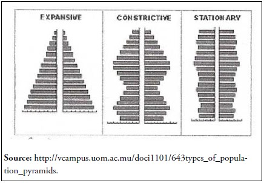

```{r setup, include=FALSE, message=FALSE, warning = FALSE}
knitr::opts_chunk$set(echo = FALSE)
```

### Contents 

[Introduction](#Introduction)


# Introduction  

This take home exercise will explore how to create two visualizations using R, namely:

- **Pareto Chart** 
- **Population Pyramid**

Each of these charts will represent the Superstore and the Department of Statistics dataset respectively.More about their datasets will be explained in their respective sessions

This article will also explain the considerations and steps taken to create the visuals for each case study. 

Lets us begin! 

---

# 2.0 Required Libraries

A list of packages would be required for this exercise. The library and its use will be explained below. 
+ [**readxl**](https://readxl.tidyverse.org) :
+ [**tidyverse**](https://www.tidyverse.org) ::
+ [**kableExtra**](https://cran.r-project.org/web/packages/kableExtra/vignettes/awesome_table_in_html.html) : 

The following code chunk will check if the required libraries are installed first before loading them into the R environment. 

```{r message=FALSE, warning=FALSE, echo=TRUE}
packages = c('tidyverse', 'readxl','knitr','kableExtra')
for (p in packages){
  if(!require(p,character.only = T)){
    install.packages(p)
  }
  library(p, character.only = T)
}
```

---

# 3.0 Case Study 1 : Superstore Dataset 

### 3.1 Case Study Overview and Dataset

The [SuperStore]() dataset contains data on order details of customers for orders of a superstore in the US. This includes order, return and shipping information. For the this first case study, we will conduct an **analysis of returns** which is an analysis about return of a product to allow management to further investigate the reason why these products are being returned. 

--- 

#### The Task 

Build a pareto chart showing the distribution of returns by product sub-category in this super store. 


### 3.2 Sketch of Proposed Design

Created by the creator of the "80/20" rule (Vilfredo Pareto), the pareto chart was meant to show the effects of losses based on different casues. 

By Ordering the bars from largest to smallest,we can visualise the "20%" that is the most critical. In this casse, factors/categories represented by "taller" bars will on the most left will have the most importance.A cumulative percentage line will give added judgement guidelines. The start of the cumulative line will raise steeply before tipping off to have more of a constant slope. 

The transition point will be the "vital few" point. the set of categories identified before the vital point can help management teams to break a bigger problem into parts and identify areas for improvement easily  

More about [pareto chart uses](https://blog.minitab.com/en/understanding-statistics/when-to-use-a-pareto-chart)

The proposed design of the sketch seen below shows the pareto chart.

### 3.3 Dataset Challenges

There is are a few dataset challenges that arosed from this analysis. They are described below : 

+ Firstly, we need to transform the data frames and model the data to suit the visualization. However, we need to first join the data frames together becuase they are normalised 

+ Second, we need to do some data wrangling to calculate the sum frequency column of different age cohorts before calculating the cumulative frequency column. 

+ Thirdly, we need to then calculate the cumulative percentage point for the cumulative line plot.

+ Fourthly, notice that while the different age cohorts are factor data type, we know that there is a certain order to it. Thus, we need to apply ordered factor function to let R know that there is a certain order to the category of these different age cohort. 

+ Fifth, Notice that while the reqeuired columns are created, the chart customisation parameters like ticks and labels are not , this step will set to create these variables 

+ Sixth, Finally, we will use ggplot2 to create the chart with customized themes and geom objects like `geom_segment` and `annotate` functions to improve the added graphics and customize the chart

### 3.4 Data Prepation 

Our first step is to read the dataset. Notice that the Superstore dataset is normalised and thus, data tables pertaining to the order and return information would exist in different sheets. 

Also notice that the file is of '.xlsx' extension which equates to excel format. As such, the **readxl** library, particularly the `read_xls` function would be used to read in the data. 

```{r warning=FALSE, message=FALSE, echo=TRUE, results ='asis', class.source="read_xls"}
# reading the data 
orders <- read_xls("./data/Sample - Superstore.xls", sheet='Orders')
returns <- read_xls("./data/Sample - Superstore.xls", sheet='Returns')
```

With the `tibble` dataframe of orders and returns seperted, we need to join these tables. We can do so using `dplyr` library join functions. The following code chunk uses a left join between returns to orders. The idea is that we are concern with returns and so we will left join returns to orders.


```{r warning=FALSE, message=FALSE, echo=TRUE, results ='asis'}
join_table <- left_join(returns, orders,
                        by = c('Order ID' = 'Order ID'))
```

```{r echo=TRUE}
# Check if there are ids that exist in returns but not in orders - there technically should not be the case
join_table[rowSums(is.na(join_table)) >= 0.7,]

```

Great! It shows that all rows have no missing data!Now we may begin to do some data wrangling! 

The code chunk below does the following as describe below: 

- Firstly, we will group the return orders by sub-category and then count the number of return orders in each of the sub-categories respectively using the `group_by` and `summarise` function. 

- Secondly, It will then sort in descending order where the largest value will represent the most left factor (Factor with the highest frequency) using the `arrange` function. 

- Finally, the `mutate` function will be used to calculate the cumulative frequency and the cumulative percentage points.

- Dont forget to ungroup once you use group by! 

```{r echo = TRUE, message=FALSE, warning=FALSE}
# Creating Pareto dataframe 
pareto_df <- join_table %>% 
                group_by(`Sub-Category`) %>% 
                  summarise('Returns'=n()) %>% 
                  arrange(desc(Returns)) %>%
                  mutate(cumfreq = cumsum(Returns), cumperc = cumfreq/nrow(join_table) * 100, per = Returns/nrow(join_table) * 100) %>%
                      ungroup() 

``` 

Now with the dataframe build for graphical representation, we will need to factorise the sub category to ensure that python understands the different levels in the sub-category column and its order. The following code chunk show how the `factor` function will be used to set this level and the order of the sub-categories.

```{r echo = TRUE, message=FALSE, warning=FALSE}
# ordering the sub categories as factors 
pareto_df$`Sub-Category` = ordered(pareto_df$`Sub-Category`, levels= unlist(pareto_df$`Sub-Category`, use.names = F))

```


### 3.5 Building the Visalisation 

To build a visualization, it is important that the graphic is tailored for the audience such that it brings the intended message across. Notice that while we have prepared the values that will be used on the pareto chart, we need to create more variables to customize the chart. 

The following code junk creates the neccessary variables for chart customization :

1. `N` is the sum or total number of return orders 
2. `y2` is the secondary y-axis label that will be used for the pareto line chart 
3. `nr` is the number of rows in the Pareto data frame 
4. `Df_ticks` contain the data frame that have three columns. Each of this column will represent the coordinates that will be used to help construct the secondary axis using geom segment object. 

#### 3.5.1 Building Graph Ticks 

```{r echo = TRUE, message=FALSE, warning=FALSE}
# configuring pareto ticks and labels 
N = sum(pareto_df$Returns)
y2 <- c("  0%", " 10%", " 20%", " 30%", " 40%", " 50%", " 60%", " 70%", " 80%", " 90%", "100%")
nr <- nrow(pareto_df)
Df_ticks <- data.frame(xtick0 = rep(nr +.6, 11), xtick1 = rep(nr +.8, 11), 
                       ytick = seq(0, N, N/10))

```

Finally! Its all ready! Lets build the graph! 

#### 3.5.2 Building the Pareto Chart

This section will explain how the Pareto chart is being build. 

To build the Pareto chart there are a few components and geom objects we need to be familiar with. 

The core components come from the ggplot2 library. It's uses in this segment is explained as follow:

- geom_bar : used to create bar plots. It makes use underlying function stat_count() which counts the number of cases at each x position 
    +  Note that this should not be confused with geom_col() which uses stat_identity() instead. 
    + Essentially the two are the same if i use geom_bar(stat="identity")
    
- geom_path :  connects the observation in order in which they appear in the data. This function will help to connect observations in original order 
    + Note that this is different from geom_line. Geom_line instead connect observations in order by the x value in the data.
    + More can be found here : (geom_path versus geom_line)[http://www.kaiyin.co.vu/2014/05/ggplot2-difference-between-geomline-and.html] 
    
- geom_point : Used to create geom_point which is a scatter plot to display relationship between two continuous variables There are other variations like geom_jitter or geom_count. In this case we will focus on using geom_point

Knowing the components of a Pareto chart, we can start to work on the parameters of these objects. The usage of parameters are as described below:

+ [aes (aesthetics)](https://beanumber.github.io/sds192/lab-ggplot2.html#Geometric_Objects_and_Aesthetics) : this parameters maps a visual cue to a variable. Some of these include specifying the x and y axis values, fill (inside), color, position.. 
  + For our case, we will adjust these parameters to help with with the graphical output 


+ scale_y_continuous and scale_x_discrete : used for scaling of the number of breaks (for y axis) and the x sub-category labeling 

+ 'guides' : are extra labels like legends that can be used to give more information. We will be removing this as we do not have mutliple facet categories or color coding. Thus will not be neccessary. We will instead make do with a secondary axis using geom_segment (segmentation) to customise the chart 

+ annotate : allow you to add all kinds of shapes or text you want to your graph
    + Note: annotate is a simplier and more efficient alternative to reduce code length when wanting to add extra graphical compoenents to the graph 
    + 2 annotations were added to the graph, one is to create a rectangle of white background for the text space while the other is to create the secondary axis y labels 
    
+ geom_segment : Draw a straight line as your state the coordinates on the cardtesian plain in which it would appear 
    + the parameters x, xend, y, yend specify where the line will start or end on the x and y axis respectively 
    + below we are using 2 geom segements to create the secondary y-axis line, followed by the ticks line that spans from the secondary y-axis to the text annotation (secondary axis y label)
    
+ labs : specifices the labels of the chart , this includes the title, subtitle, x and y axis-titles 

+ themes() : themes function is a way to customize all non-data display. We will be using the complete theme: theme_bw() and further specific the text size of both the x and y axis text and title labels.

Combining the knowledge of this, we will proceed to build the chart.

```{r echo = TRUE, message=FALSE, warning=FALSE, fig.width=9.5, fig.height=4.5}
# need to adjust
# the pareto chart

ggplot(pareto_df, aes(x=`Sub-Category`, y=Returns)) + 
  geom_bar(aes(y=Returns), fill='lightblue', stat="identity") +
  geom_path(aes(y=cumfreq, group=1), color="black", size=0.9) +
  geom_point(aes(x=`Sub-Category`, y = cumfreq),color="black") + # pch is typ of pointer 
      scale_y_continuous(breaks=seq(0, N, N/10))  +
      scale_x_discrete(breaks = pareto_df$`Sub-Category`) +
      guides(fill = FALSE, color = FALSE, scale="none") +
      annotate("rect", xmin = nr + 1, xmax = nr + 2, 
               ymin = -.03 * N, ymax = N * 1.02, fill = "white") + # create the space 
      annotate("text", x = nr +1.2, y = seq(0, N, N/10), label = y2, size = 2.5) + # create the labels
      geom_segment(x = nr + 0.6, xend = nr+0.6, y = -.02 * N, yend = N * 1.02 , color = "grey50") + # create the line 
      geom_segment(data = Df_ticks, aes(x = xtick0, y = ytick, xend = xtick1, yend = ytick)) +  # create the ticks 
      
      labs(title="Pareto Chart - Returns by sub-category", subtitle="count of the number of returns by sub-category", 
           x="sub-category", y="absolute frequency") +
      theme_bw() +
      theme(axis.text.x = element_text(size=rel(0.8))
            ,axis.title.x = element_text(size=rel(1))
            ,axis.text.y = element_text(size=rel(0.8))
            ,axis.title.y = element_text(size=rel(1))
            )

```


### 3.6 Conclusion and Interpretation

From the above pareto chart, vertical bars that arranged in a ranked order with the sub-categories that contributes the most to the number of return orders would appear on the most left. The cumulative line would show the percentge point for each bar starting from the left (highest contributor to return orders). 

As mentioned above, the parto chart would allow us to identify the *vital few* sub-categories that contribute most to the reutrn orders. Following the *80/20* rule, out of 17 unique categories, 20% would represent 3.4 categories.To make things simple, lets take a look at the contribution of the first four categories.

The top four categories actually contribute more to the number of return orders compared to the rest of the categories. We know this because the slope of the cumulative percentage line plot shows it; where the slope starts to slowly slow down after the first four categories. These four categories and their individual contribution to the cumulative curve are shown below : 

*Binders : 17.1 percent
*Paper : 15.1 percent
*Phones : 9.1 percent
*Furnishing : 8.7 percent

<put table>

In total, these four categories amounted to a total of 1614 out of 3226 return orders; around 50% of the total return orders.

It seems that the customers of this super stores return alot of small items like binders and paper but they also return more expensive bulky items like phones and furnishing. This information is crucial because returning of bulky items can become costly for company if these bulky items were to be damaged on return. Furthermore, small items like just binders and papers add up to about 32.2% which will require further investigation as to why customers are returning so much small items.


# 4.0 Case Study 2 : Singapore Residents Singstat Dataset

### 4.1 Case Study Overview and Dataset

The [Singapore Residents by Planning Area/Subzone,AgeGroup.Sex and Type of Dwelling Singstat Dataset](https://www.singstat.gov.sg/find-data/search-by-theme/population/geographic-distribution/latest-data) representing the number of people staying in different regions of Singapore with age cohort, sex and dwelling details 

---

#### The Task
Build an age-sex pyramid representing the demographic structure of Singapore by age cohort and gender 

### 4.2 Sketch of Proposed Design
The proposed 

The Population pyramid is used to present the distribution of different age cohort representing a particular population. It is well known for its pyramid looking shape. It typically...

Typically it shows a continuous stacked horiztonal histogram bar. The population size is on the x-axis while the age-cohort would be presented on the y-axis. The height of each bar typically represents either an absolute frequency or a percentage of the number of people in each age cohort. 

The proposed design of the sketch seen below shows the population pyramid chart.

### 4.3 Dataset and Challenges

-help


### 4.4 Data Prepation 

Our first step is to read the dataset. Notice that the Singapore Singstat dataset is -help

Also notice that the dataset is of '.csv' extension which equates to comma separated field format. As such, the **readxl** library, particularly the `read_csv` function would be used to read in the data. 

```{r echo = TRUE, message=FALSE, warning=FALSE}
#Reading the Data
respo_df <- read_csv("./data/respopagesextod2021.csv")
```

Next, we will encode the dataset into the respective age bins (categories) in an ordered manner, with those of ages 0 being the smallest and over 90 being the largest value in the scale.

```{r echo = TRUE, message=FALSE, warning=FALSE}
respo_df$AG <- factor(respo_df$AG, ordered=TRUE ,levels=c("0_to_4","5_to_9","10_to_14",
                                                          "15_to_19","20_to_24","25_to_29",
                                                          "30_to_34","35_to_39","40_to_44",
                                                          "45_to_49","50_to_54","55_to_59",
                                                          "60_to_64","65_to_69","70_to_74",
                                                          "75_to_79","80_to_84","85_to_89","90_and_over"))
```

Upon encoding the categories the relevant data will be extracted from the dataset.
AG (Age), Sex and Pop will be selected and grouped by AG and Sex. The corresponding values for these groups will be the total sum of the Pop of these groups and the data will be ordered by Sex and AG. The values will then be ungrouped for data visualization

```{r echo = TRUE, message=FALSE, warning=FALSE}
# GET DATA
ag_df <- respo_df %>% 
  select(AG, Sex, Pop) %>%
  group_by(AG,Sex) %>% 
  summarise(Total = sum(Pop)) %>%
  arrange(Sex,AG) %>%
  ungroup()
```

Next, the total Pop size of males for each group will be multiplied by a factor of -1 to vertically flip the values from the positive x-axis to the negative x-axis.

```{r echo = TRUE, message=FALSE, warning=FALSE}
# All males are negative so they go to the left
ag_df$Total <- ag_df$Total/1000
ag_df$Total <- ifelse(ag_df$Sex == "Males", -1*ag_df$Total, ag_df$Total)

```

### 4.5 Building the Visalisation 
To build a visualization, it is important that the graphic is tailored for the audience such that it brings the intended message across. Notice that while we have prepared the values that will be used on the pareto chart, we need to create more variables to customize the chart. 

The following code junk creates the neccessary variables for chart customization :

1. `N` is the sum or total number of return orders 

#### 4.5.1 Building Graph Ticks 

```{r echo = TRUE, message=FALSE, warning=FALSE}
# creating ticks 
N = max(ag_df$Total)

```

#### 4.5.2 Building the Population Pyramid Chart

This section will explain how the Population Pyramid Chart was build. 

To build the Population Pyramid chart there are a few components and geom objects we need to be familiar with. 

The core components come from the ggplot2 library. It's uses in this segment is explained as follow:

- geom_bar : used to create bar plots. It makes use underlying function stat_count() which counts the number of cases at each x position 
    +  Note that this should not be confused with geom_col() which uses stat_identity() instead. 
    + Essentially the two are the same if i use geom_bar(stat="identity")

+ scale_y_continuous and scale_x_discrete : used for scaling of the number of breaks (for y axis) and the x sub-category labeling 
    
+ labs : specifices the labels of the chart , this includes the title, subtitle, x and y axis-titles 

+ themes() : themes function is a way to customize all non-data display. We will be using the complete theme: theme_bw() and further specific the text size of both the x and y axis text and title labels.


```{r echo = TRUE, message=FALSE, warning=FALSE,  fig.width=7, fig.height=6}
# Graph itself
ggplot(ag_df, aes(x = AG, fill = Sex,
                 y = Total)) + 
  geom_bar(stat = "identity") +
  scale_y_continuous(n.breaks=18, labels=abs, limits = N * c(-1,1))+
  coord_flip() +
  scale_colour_manual(values = c("pink", "steelblue"),
                      aesthetics = c("colour", "fill")) +
  labs(title="Constrictive Population Pyramid of Ang Mo Kio Residents ", subtitle="Total number of Ang Mo Kio Residents by their respective age groups follows a bee hive distribution", 
       x="Age Groups", y="Number of People (In Thousands)") +
  theme_bw()
```


### 4.6 Conclusion and Interpretation
Population pyramids are important graphical representation to undestand the composition of population memebers.

it is typically visualised by grouping the population memebers into age cohorts and diving by gender. In other words, the age-sex struture of specific populations. 
This makes it easy for demographers to compare the difference between male and female populations and the structure of the population at any given moment. 
Demographers/researchers typically use this to study the trend of populations relating to the fertility and mortality.

There are three trneds in  population pyramids they are typically:
- expansive
- constrictive
- stationary 

#

We shall focus our efforts in explaining the trend that is reflected in our plot. 


#### Chart interpretation and conclusion 

The Singapore population trend across all regions for both gender is depicted to follow a constrictive trend with its 'beehive' shaped.

-It has a shape with a wide area in the middle covering the middle age group from 15 to 64. 
-It has a narrow base with the younger age cohort (typically below 15) 
-It has a narrow tip with the elderly age group (typically over age of 64)

As observed in our population pyramid, there is observed to be lower mortality and fertility rate. This translate to lower birth rates (lesser in the younger cohort) and death rates (lesser in the elderly age cohorts).Population members mostly reside in the middle age group and elderly people compared to younger age groups. 

Overall, the population pyramid with a constrictive trend represents a population that is shrinking. With a constant fertility rate and a large middle age group which would grow old eventually, will result in a shrinking population.

Research have shown that constrictive population pyramids are typical of countries with higher socio-economic developement who have access to higher quality education and accessible healthcare avalaible to a large proportion of the population. 

These include standard of living simialr to that of singapore like japan germany and italty

Code are here ! for population pyramid 

## 5 Benefits of using R over Tableau


