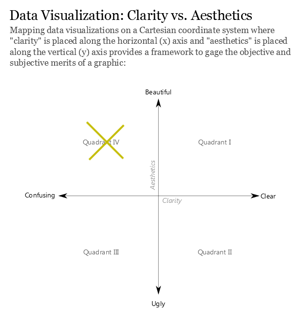
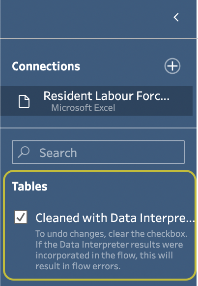
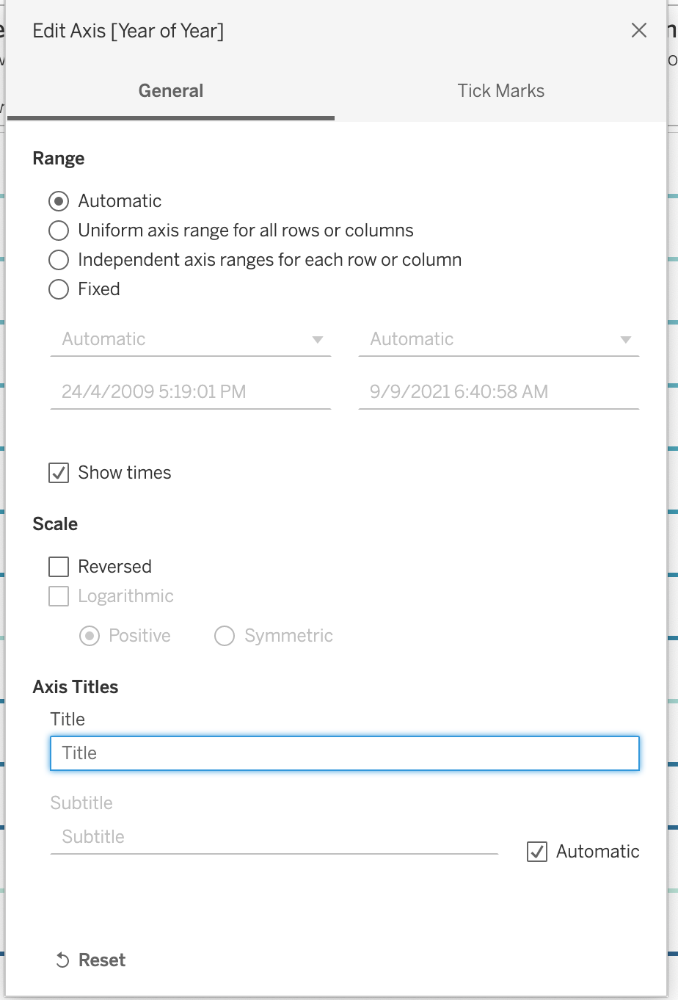

```{r setup, include=FALSE}
knitr::opts_chunk$set(echo = FALSE)
```

# The Task

Firstly, to critic the graph based off clarity and aesthetics and provide suggested alternatives with reference to an original visualization about the problem. Secondly, to create the improved graph in tableau and provide a detailed step by step procedure. Finally, to provide three major observations revealed by the improved graph.

## Understanding the task and the given dataset 

First, the data set provided represents the labor participation rate of Singapore from 1991 to 2021.The data set also provides the break down of the labor force participation rate separated by gender. For this task, we are only interested in a 12 year period from 2012 to 2021. We also note that the raw data set is not optimal for the recreation of the original visualization. We also note the use of tableau prep which will be explored to ready the data and prepare it for visualization. 

Secondly, we will dive into how come about our final visualization product. We will look at the different visual elements and draw out visualization critics and improvement points before finally diving into the creation of the final visualization product. 

---

# 1. Critique of Visualisation 

 

The original data visualization is created by tableau using the data provided by Ministry of Manpower page entitled [Satistical Table: Labour Force](https://stats.mom.gov.sg/Pages/LabourForceTimeSeries.aspx). However, there are a couple of graphical elements of data visualization that needs to be changed. 

In this section, we will explore these elements and critic the original visualization. We will critic this visualization by weighing the odds between clarity and aesthetics and attempt to classify it into one of the four quadrant provided by [DataRemixed](https://dataremixed.com/2012/05/data-visualization-clarity-or-aesthetics/) as seen below : 
 

The quadrant will give us good guidelines into what is expected to aim for quadrant 1. As of now, the original visualization is placed in quadrant 4; marked with an "X" as seen above.


## 1.1 Clarity 

**Clarity** : Represents the "Function" of the graph, being able to portray the intended message. ***"Let me be clear: being clear matters the most, and it’s not even close"***

From the original visualization, the author's intended message is unclear. Much of the context is being left out with so little elements providing important information being left out. It makes it hard to answer the question ***What is the primary comparison the chart wants the audience to make?***. After some close observation and guess work, it seems like the author wants to show the labor force participation rate across all age groups regardless of gender. However, this is not all that straight forward due to elements missing from the chart that has affected its clarity. 

So now, lets critic it in terms of clarity:

**(a) Insufficient crucial information** : 

* It is clear that the graph represents the "Labor force participation rate" as stated in the title. However, there is missing crucial information. The author has miss out the context of his message as there is no additional important information like "Location/Country" or "Time Period the data represents". There is neither any annotation nor subtitle that provides additional information.This leads to a lot of guess work on the side of the user. Without these information, the viewers have to end up guessing what this chart represents and what is the "primary comparison" it is trying to make with all the age groups laid out. 
  +   It would be more appropriate to : provide the title with the highlighted message/information about the graph (main message). It will capture the attention of the users first and give them the first impression about what the graph is trying to highlight. Subtitles can also be provided to give additional information about the graph context or extra information about the graph.

* Apart from the use of abbreviation that make people guess 'Lfpr' is "Labor Force Participation Rate", it would useful if a link or an annotation is used to provide some information on the derivation of the "Labor Force Participation Rate". 
  +  It would be more appropriate to : avoid using short form or abbreviation of words. While it may be familiar to experts in the domain, it will be unfamiliar for the layman viewers who come across the graph, this will not be an effective visualization to "speak to the masses" . 

This brings us to the second point.

**(b) Story is not clear due to distorted axis**: 

* Notice that the x-axis is a timeline. However, notice also that the area chart is continuously trending with grid lines spanning across and very light tick marks showing that values are not meant to represent a value in a point in time but a continuous trend over time. If in fact, this plot is to show only data for 2015, it should be a single point value rather than a continuous area chart. The x-axis in this case has mislead users into thinking that it represents only 2015 labor participation rate; but in fact, it is meant to represent the labor force rate from 2010 TO 2021. 
  +   It would be more appropriate to : For Continuous timeline charts, it should be given ample space to show the points in time. While not all information is necessary, the timeline provides the context of which period is the data representing. Thus, we will need to insure enough space is given to show the full scale of the time line and provide more indications for the time periods. We can do this by playing with the headers, adjsuting its font or considering if axis headers/titles/labels are even important

**(c) Ordered categories of the facet wrap do not make sense:**  

* As mentioned, the x-axis is a time series (continuous). Graphical representation of a timeline by default would move from left to right. The author have intentionally distorted the sequence of the age group (facet groups) in order to mislead users into thinking that the labor rate is going upwards. This easily leads people into the wrong conclusion.
  + It would be more appropriate to : Check your data and provide the proper arrangement of groups unless the graph itself allows for rearrangement of group order like a bump chart. 

**(d) Colors are misleading and clouds the clarity** : 

* Colors should only used to serve a particular communication goal. In this case, the use of many colors to represent the different age groups is misleading. The use of many colors can cause confusion as to what is the trend line comparing against. Often, the use of different colors is only used to correspond to differences of meaning in the data. 
  + It would be more appropriate to :This is sequential data pertaining to the same category of values. it would be misleading to the message if different colors are used. Thus, applying a gradient set of colors would be more appropriate.

## 1.2 Aesthetics 

Aesthetics : Representing the "Form" of the graph, the ability to take on a kind of looks is rather subjective. However, it is clear from both materials that Aesthetics " should only be discussed once clarity has been achieved". The original visual has a form that is symmetric, with its axis-es titles and text centralized and a well aligned title. It also try to use color to differentiate the many age group segment and provide grid lines to guage the area chart value. However, apart from this there are a number of visual elements that can be improved. 

They are as follow : 

**(a) Data Inking** : Data ink by Edward Tufte: "Data ink ratio is the proportion of the graphics ink devoted to the non redundant display of information". 

* The bold titles of the axis-es : "Age-Group","Lfpr" and "Year" stand out stronger than the title itself. In addition, the legend title is also bold equally as much as the axis-es. Inking these elements in this manner has drowned the purpose of a chart title. Attention of its viewers at first glance would be drawn towards the axis titles and the legend rather than the title.
  + It would be more appropriate to : Highlight main titles, subtitles, important information highlighted by annotation and axis titles. We can downplay the ink for legends but the former should be highlighted since we want to reduce eye movement of users when they are looking for information  

* The age group label that separates the chart into different parts have a lighter ink than its legend counter parts. The legend referring to these age groups have a darker ink and thus, more highlighted. As such, the legend captures the attention of its Viewers more. This leads viewers to rely more on the legend causing lots of eye movement.
  + It would be more appropriate to : Darken the data ink on age group labels; like highlighting the age groups but yet not over powering the inks of the titles. It can help capture the viewer's attention enough; this provides ample highlighting to the users.

* Data ink of the tick marks: The time series patterns are continuous and tick marks would become necessary. In this case, the author ink on the single text '2015' is much darker than the ever-so light ink of the tick marks. On first glance, it might look like this single text of '2015' is not referring to any tick mark. But in actual fact, there is a tick mark but its very light to the point that the x-axis label '2015' look like its "floating".
  + It would be more appropriate to :In this case, enhancing the ink of x-axis tick marks would give users better information on which year, they are looking at. In the case of a chart that does not require tick marks like a heatmap, ensure that there are proper referencing lines to help guide judgement. 

**(b) Axis Titles and Spacing Issues**: 

* Notice that while the x-axis titles are consistent, they are repeatedly unnecessarily. Each of the age group segments represent the same time frame. This however, could be due to a spacing problem. Notice that the width of each age group segment is too narrow. This has led to the short length of the x-axis. Although this is an aesthetics problem, this duplication can lead to clarity issues at first glance (As if to be hinting some importance on 2015, as explained in the clarity section).Thus, width is needed for people to analyse the time series data with ease. **This is especially so for a time series line chart**. The small width of the graph have distorted the time series pattern. 
  + It would be more appropriate to : This should be accompanied with a way to create more space and expand the axis to be able to view a wider range.

* Abbreviations and using the default column name as axis title is not appropriate as it can make the visual seem unprofessional and not well prepared. 'LFPR' and 'Age-Group'.
  + It would be more appropriate to : Label the axis more professionally like 'Labor Force Participation Rate' and 'Age Group' respectively.

* Group labels are also not complete, viewers often have to refer continuously to the legend and match the color in order to know which group they are looking at. The group label is cut short for '75 & Over' and '70 and Over'. 
  + It would be more appropriate to : ensure that all labels are not cut short of. This will ensure that labels represent what they need to and provide users with better clarity of the labels.One way is to change the orientation of the chart where each age group segment is now a horizontal area chart.

**(c) Using Colors Appropriately** : 

* We should only use different colors when corresponding to the difference in the meaning **in the data**. Each of the colors represented in this graph represent a different category of age group. By using colors to differentiate the groups, it has led to an over use of colors in the chart and is not practical for viewing.This also relates to the use of colors to high light information. There is no different shade or stronger contrasting colors used on the chart to help highlight certain information. Additionally, notice that the legend on the right has become very long as it needs to display the colors of all age groups.
  + It would be more appropriate to :Instead we should stick to a single hue of varying intensity to represent a sequential range of quantitative values as explained in clarity section too.

### The verdict 
Overall The graph is parked in Quadrant IV. While, it tries to provide some level of aesthetics, aligning the symmetry of text and play of colors, its use of these elements have resulted in a lack of clarity of its message. 

# 2. Sketch Of Proposed Design 

```{r echo=FALSE, fig.cap = "Stacked Bar Chart Sketch Up"}

```

```{r echo=FALSE, fig.cap = "Bump Chart Sketch Up"}

```

```{r echo=FALSE, fig.cap = "Heat Map Sketch Up"}

```

```{r echo=FALSE, fig.cap = "Dashbooard Sketch Up"}

```

The explanation for each chart is as follow: 

1. Stacked Bar Chart : Would be used to show the over all proportion of differnt age group in terms of labor force participation rate over the years. 

2. Bump Chart : Would be used to rank the labor force participation rate of age groups and observe cross patterns (changes in ranks) over the years 

3. Heat Maps : Would be used as a graphical way to quickly identify the trends across all age groups over the years. 

# 3. Data Preparation

The data provided is as shown : 

```{r echo=FALSE, fig.cap = "Raw Sheet 1"}

```

```{r echo=FALSE, fig.cap = "Raw Sheet 2"}

```
We will refer to the above tables as "Raw Sheet 1" and "Raw Sheet 2". 

- Raw Sheet 1 : Raw Sheet 1 represents the labor force participation rate of an over arching category group. For example, "15 to 19" and "20 to 24" would represent group "15 to 24". This is good for aggregating individual age groups seen in "Raw Sheet 2". It can be used as a way to observe overall trends of the labour force participation rate across age groups at a higher level of granularity. 

- Raw Sheet 2 : Raw Sheet 2 represents the labor force participation rate of individual age groups; similar to the age group set of the original visualization. For example, "15 to 19", "20 to 24".... This is the sheet in which the original visualization seek to compare. It would be used for our main visualization.

Notice that both sets of data have their own value. In the next section, we will explain the step by step how we can make use of information from both charts to prepare the data and produce the final visualization data set.

## Step by step data preparation and issues 

In this section we need to create the format in which Tableau can use to read and apply the appropriate aggregation methods. We will first explain the data issue faced and explain the step by step procedure on how we over come this problem and better prepare the data. 

For data preparation, we will utilize **Tableau Data Prep**.

### Setting the Goal

Reproducibility is an important factor when documenting your analysis. Others who view your blog post should be able to follow the step by step clear instructions to reproduce your work. It is also important to provide the explanation for each step. This allow others to understand why certain actions are needed. Before diving into the data preparation sections, we will first introduce a few interface terminologies that is used throughout this article explanation. We will do this by walking through the few basic steps needed to set up the interface to begin the data preparation process.

### Basic Set up and Introduction 

[Tableau Data Prep](https://www.tableau.com/products/prep) is a rather straight forward tool with drag and drop features that can seamlessly integrate into a pipeline for data cleaning and preparation purposes. To begin, we will:

1. **import** a data set into user interface by either dragging the file onto the platform or by clicking the "Connect to Data" button highlighted in orange; followed by the '+' icon on the upper left corner of the screen under the connections card and click on excel to navigate to the file using the file explorer pop up. 

2. Once successful, the data will appear on the same section as the "connections" column. 

```{r echo=FALSE, fig.cap = "Data Import Welcome Screen"}
knitr::include_graphics("./images/data_prep/importStep1.png")
```

```{r echo=FALSE, fig.cap = "Data Import Connection Set Up"}
knitr::include_graphics("./images/data_prep/importStep2.png")
```

```{r echo=FALSE, fig.cap = "Example of Data Import Excel Sheets Being Loaded"}

```

Note that we will turn on the [Data Interpreter](https://help.tableau.com/current/pro/desktop/en-us/data_interpreter.htm) option. This is because the data interpreter is designed to help identify the structure of the data in the Excel file and turn it into the proper format for analysis in Tableau. To enable the data interpreter. 

1. "Check" the data interpreter check box as seen along the side panel 

```{r echo=FALSE, fig.cap = "Checking Data Interpreter"}

```

Once done, we can proceed to start pipe-lining our data cleaning and preparation process. 

1. To do so, we will drag the imported data from the side on to the white canvas on the left. This automatically loads the data and a data card would appear. 

2. Notice that beside the data card, there is a "+" button. Click this option we can select a set of operations that would be used throughout this data preparation process. Now that the data is loaded on to the platform, we will begin explaining the data issues and how we remedied it. 

```{r echo=FALSE, fig.cap = "Tableau Data Prep Interface and Data Import"}

```

#### Indistinguishable columns issue

Upon reading in the data, we can explore the data by clicking on the values of the columns.

However there is one problem, notice that for each age group, it is not distinguishable. This is due to the way the raw data is portrayed. We will thus, have to rethink of a way to re-arrange the three categories namely: `Total` Category, `Male` Category and `Female` Category. There are a couple of steps to remedy this. One way is combined the age group name with a sub string in which we can split by delimiter in Tableau data prep.

```{r echo=FALSE, fig.cap = "In-Distinguishable Columns"}

```

Thus, back to Excel lets adjust the data.

1. We will attach the categorical sub string to the "Age (Years) / Sex" column  

2. We will rename this sheet to **mrsd_Res_LDPR_2_Adjusted**  

```{r echo=FALSE, fig.cap = "Adding a Delimiter to Age-Sex Column. We will rename this sheet to mrsd_Res_LDPR_2_Adjusted "}

```

Overall, we will work with **mrsd_Res_LDPR_2_Adjusted** sheet as the raw data. We will proceed to reload this sheet onto the tableau data prep canvas. 

#### Removing Uneccessary Columns and Rows

Notice that there is data pertaining from 1991, however, we are only interested from 2010.

1. Hover over the columns we do not want, hold "shift" on your keyboard and click on it. For our case it would be columns pertaining to years 1991 to 2009. This will highlight all unwanted columns in blue as seen below.

```{r echo=FALSE, fig.cap = "Exclude all Unwanted Years"}

```

2. Next we will go head and split the columns by the added delimiter "-" of the "Age (Years) / Sex" column. To do so, we will "Right Click" the column and click on "Split Values" option. Select "custom split" option as seem in the image below. 

```{r echo=FALSE, fig.cap = "Selecting the Custom Split Function"}

```

2.1 Next, we will proceed to input "-" as the delimiter and the number of fields we want to get out of this split is 2 as seen below. This will split the column into two: one pertaining to the overall category and another the age group.

```{r echo=FALSE, fig.cap = "Custom Split Option. Input '-' and 2 field to be achieved from this function"}

```

Doing so produces the following :

```{r echo=FALSE, fig.cap = "Result of Custom Split Function"}

```

Notice how the rows are now distinguishable as they fall into their respective unique categories. Also, notice that the old column is now not needed. We will proceed to remove it.

```{r echo=FALSE, fig.cap = "Removing the old 'Age (Years) / Sex' column "}

```

3. Notice that for the age groups, we have a few over lapping age group categories. For example, notice we have "70 & Over" and "75 & Over". However, notice that "70 & Over" consist of "70 to 74" and "75 & Over", at the same time, we have "65 & Over" from the  **mrsd_Res_LDPR_2_1**  sheet. We will choose to delete all rows pertaining to "70 & Over" that is because, we already have a granular level of "65 & Over" and deeper granular level of "70 & Over" can provide us greater details into the labor force participation of older age groups after analyzing that Singapore possess an aging population trend.Thus, to remove rows in the category of "70 & Over". 
  + "Right Click" the category value "70 & Over" under the age group column. 
  + Select "Exclude" ; all rows pertaining to "70 & Over" will be removed

```{r echo=FALSE, fig.cap = "Removing Unwanted Rows pertaining to Age Group 70 & Over"}

```

```{r echo=FALSE, fig.cap = "Results of Removing Age Group 70 & Over"}

```

#### Years is a feature not a categorical value

Realize that the `Years` is the column names. 

In business context, typing a new 'year' as a column and entering the values in the rows below is a common approach for data entry; **each column represents a set of values pertaining to the year** The problem is that tableau will read these columns as features on its own rather than distinctive categorical values of a column. We can do so by pivoting the table and getting each year to be a column. In doing so, it will transpose the table in which the columns will become the values. 
  1. Add a pivot card and highlight all columns from 2010 to 2021.
  2. Drag all the columns pertaining to the years from 2010 to 2021 into the pivot field window beside it.

This will pivot the table and create a new column with its values as the years from 2010 to 2021. At the same time, the values pertaining to each year will now be rotated vertically in to a single column. In doing so, **each row now differentiate each value pertaining to a year**. 

```{r echo=FALSE, fig.cap = "After adding the Pivot Card, shift highlight the years and drag them into the pivot field pane"}

```

```{r echo=FALSE, fig.cap = "Results of the Pivot"}

```

Notice that after the pivoting, each year now becomes a categorical column called "Pivot1Names".We will apply grouping to age groups and rename the columns in the next section.

#### Renaming Columns

We will go ahead to rename our columns for readability. Double click on the column header to change its name. Here is what we got so far :

```{r echo=FALSE, fig.cap = "Renamed Columns for Readability"}

```

#### Adjusting the Age group Ganularity 

Another problem identified in the original visualization is that the number of groups represented is too granular. If we can find a way to categorize these age groups into larger categories, it would be easier for us to see overall trends. To do so, we can create a calculated field, following the level of granularity of age groups provided in `mrsd_Res_LFPR_1`. 

We can do this by adding a clean card. After which, we can follow these steps. 

1. Click on the create calculated field after which a calculated field window would open, the formula to group the age groups are seen in the image below:
2. Type the formula seen in the image in to the formula box
3. Rename the calculated field to "Overall Age Group"

```{r echo=FALSE, fig.cap = "Aggregating Age Groups Through a Calculated Field"}

```

#### Adjusting the Data Type of Columns

Before embarking to output the data, lets ensure that the data is in the right data format and type. We can observe the symbols on the column card as highlighted in blue box below:

```{r echo=FALSE, fig.cap = "Notice the Data Type Symbol Highlighted in Blue"}

```

Apart from all other fields which are in their right format, notice that year is considered a numerical column rather than a date field. In tableau, we can drill down a date field to lower levels of granularity. We can also do so with this field if we convert this to date field for it to be recognized by tableau later. As such, lets convert years to a date data type column. 

To do so: 

1. Click on the Data Type symbol on the "Year" column and click on "Date" option. 

Immediately, you will notice that the column data type has changed. It will be converted with a default of '1/1/<year>' as seen below. 

```{r echo=FALSE, fig.cap = "Clicking 'Date' Data Type"}

```

```{r echo=FALSE, fig.cap = "Result of Converting 'Year' to 'Date' Data type"}

```

#### Producing the Final Data Output

In this stage, we will create a new 'output' card and output the data in excel format. After adding the output card, follow the settings listed below. The only thing you need to look out for is when creating a new excel sheet, make sure to select worksheet and enter the name of the worksheet. "Click " on create new worksheet and you can output your data just fine.

```{r echo=FALSE, fig.cap = "Settings for Output Data to Excel Sheet"}
knitr::include_graphics("./images/data_prep/OutputFile.png")
```

This marks the end of the data preparation stage using data prep. The final data excel file is called **LabourForceParticipation_AG_Deepxl.xlsx**

```{r echo=FALSE, fig.cap = "Final Data Preparation Flow on Tableau Data Prep"}

```

---
# 4. Visualization

## 4.1 Stacked Bar Chart
This bar chart depicts the proportion of each age group every year. We will first filter the data

The data should be filtered based on Gender and Age Group to extract values of interest to us. As such, we will exclude the "Overall" age group and only use the "Total" Gender, suggesting that the participation rate we are using is the weighted average of male and female participation rate in the labour force. To do so, we drag the two fields, `Overall Age Group` and `Category` into the filter tab as seen below. Following, we will select "Total" for Gender and "Overall" with the "Exclude" button for Age Group.

```{r echo=FALSE, fig.cap = "Filters"}

```

```{r echo=FALSE, fig.cap = "Filter Gender"}

```

```{r echo=FALSE, fig.cap = "Filter Age Group"}

```

After filtering the data, we can now generate the base chart. Firstly, drag the `Year` into "Rows". Ensure that the `Year` is discrete (blue). If it is not, we can simply click onto it and select the first "Year" selection in the drop down bar. Following, we will drag the `Labour Force Participation Rate` into "Columns". Ensure that the `Labour Force Participation Rate` is aggregated using "SUM". Next, we have to include a "Quick Table Calculation" by "Percent of Total" computed using "Table (across)". With this, the base chart is completed.

```{r echo=FALSE, fig.cap = "Discretize Year"}

```

```{r echo=FALSE, fig.cap = "Update Table Calculation in Row"}

```

```{r echo=FALSE, fig.cap = "Update Compute Using in Row"}

```

Subsequently, we will include `Overall Age Group` into the colour box, and `Labour Force Participation Rate` into the label box under "Marks". We will then update the calculations of `Labour Force Participation Rate` similar to that of the above - Quick Table Calculation by "Percent of Total" computed using "Table (across)". 

```{r echo=FALSE, fig.cap = "Update Table Calculation in Label"}

```

```{r echo=FALSE, fig.cap = "Update Compute Using in Label"}

```

With this, we have completed the generation of the stacked bar chart. 

```{r echo=FALSE, fig.cap = "Update Table Calculation"}

```

## Aesthetic Choices

```{r echo=FALSE, fig.cap = "Update Table Calculation"}

```

To finalize the chart aesthetics, we will incorporate the elements and pointers mentioned in the above section. 

First we will edit the colors of the chart using the format plane. To format the labels of the chart using the format plane, simply right click on the label of the chart and click "Format". 

```{r echo=FALSE, fig.cap = "Right Click Label to Enter Format Plane"}

```

We will change the colors by clicking on the drop down under Default > Worksheet. This will allow us to select the color as seen in the images below. Selecting the color will change the labels in the stacked bar chart itself. 

```{r echo=FALSE, fig.cap = "Formatting Chart Label"}

```

Secondly, we will remove the headers of the percentage as it already have the in chart labels. Labeling the axis with the percentage would be redundant as that would be repeated information. At the same time removing the axis headers would provide for additional space for the chart elements. To remove the headers, we will just simply right click on the x-axis and uncheck the "Show Headers" options.

```{r echo=FALSE, fig.cap = "Removing Bar Chart Headers"}

```

Lastly, We will provide the necessary information in the chart title. We will first start with the main header that highlights the chart message. Followed by the subtitle that provides extra information including information to help users gain a quicker understanding of the graph. Like "Darker Blues Represent Older Populations". We will just double click on the chart title for the title format plane to appear. We will highlight the main title and set it to "11 font size bold". The rest is "9 font size". **Note that this format is the same for all other chart titles**

```{r echo=FALSE, fig.cap = "Finalized Figure 1 Stacked Bar Chart"}

```

As mentioned above, it will help us to capture the first impression of the viewers on what the chart is about. The final chart is as seen below. The interpretation would be done in the major observations sections.

```{r echo=FALSE, fig.cap = "Finalized Figure 1 Stacked Bar Chart"}

```

---

## 4.2 Bump Chart

A bump chart is a special form of a line plot designed for exploring changes in rank over time. The use of a bump chart in this visualization helps us understand the changes in ranking of Singapore's labor force participation rate across the different age groups. An age group with a higher rank suggests that people of the age group has higher participation rate in the labor market than that of those with lower ranking. To begin, we have to create a calculated field which depicts the ranking of an age group based on the average labor force participation rate of that group.

To create the `LFPR Rank` field, we have to first select the drop down arrow beside the search bar on the top left corner. Upon selecting the drop down bar, select "Create Calculated Field". The `LFPR Rank` is calculated using the formula: `RANK(AVG([Labour Force Participation Rate]))`. Next, we have to compute this ranking by Age Group. Select the "Default Table Calculation" above the "OK" button and select "Age Group" under the "Compute using:" field. Upon selecting "OK" in this Table Calculation tab, we will see a yellow pop-up above the calculation stating "Results are computed using Age Group". With this, we are done with the calculation of the `LFPR Rank` field.

```{r echo=FALSE, fig.cap = "Create Calculated Field (LFPR Rank) by Age Group"}


```

The next step would be to filter the data based on Gender and Age Group and only extract those of interest to us. As such, we will exclude the "Overall" age group and only use the "Total" Gender, suggesting that the participation rate we are using is the weighted average of male and female participation rate in the labour force. To do so, we drag the two fields, `Overall Age Group` and `Category` into the filter tab as seen below. Following, we will select "Total" for Gender and "Overall" with the "Exclude" button for Age Group.

```{r echo=FALSE, fig.cap = "Filters"}

```

```{r echo=FALSE, fig.cap = "Filter Gender"}

```

```{r echo=FALSE, fig.cap = "Filter Age Group"}

```

After preparing the data required for the bump chart, we can start to create the bump chart. First, we will creat the base chart with the ranking line of each age group. This is done by dragging the `year` into "Columns" section and `LFPR Rank` into "Rows" section. At this stage, you may see an error on LFPR Rank (it's in red). Don't worry, all you need to do is drag the `Age Group` field into the Details.

```{r echo=FALSE, fig.cap = "Create Base Chart"}

```

After the base chart is created, we will notice that the LFPR Rank axis is from 0 to 14, bottom to top. However, understanding that ranks should have a reversed axis, where the first rank should be on top instead, we will flip the axis. To do so, we can right click the y-axis (LFPR Rank axis) and select "Edit Axis". Next, select the "reversed" checkbox and close the pop up tab. With this, we have completed the base chart.

```{r echo=FALSE, fig.cap = "Reverse y-axis"}
knitr::include_graphics("./images/ccf/EditAxis.png")

```

To include the circle labels on the chart, we need to include the second axis into the chart by dragging another `LFPR Rank` into "Rows". Next, we will enable "Dual Axis" and "Synchronize Axis". This can be done by selecting the second `LFPR Rank` in the Rows section and choose "Dual Axis". Next, right click the y-axis on the right and select "Synchronize Axis". This will overlap the two charts to make it seem like one. To create the circles, we need to change the mark type. The mark type can be changed at the Marks panel. On `LFPR Rank (2)` we can select "Circle" to create the circles in the chart. 

```{r echo=FALSE, fig.cap = "Include LFPR Rank for second axis"}
knitr::include_graphics("./images/ccf/AddSecondRankAxis.png")
```

```{r echo=FALSE, fig.cap = "Create dual axis"}


```

```{r echo=FALSE, fig.cap = "Synchronize y-axes"}

```

```{r echo=FALSE, fig.cap = "Change mark type to circle"}

```

```{r echo=FALSE, fig.cap = "Dual Axis Chart Base"}

```

After updating the chart marks, we will include the labels into the circle marks and customize the chart. To include labels into the circle marks, we will have to drag `LFPR Rank` into the Label box under the Marks section for `LFPR Rank (2)`. Upon doing so, we will have to enable "Show mark labels" and "Allow labels to overlap other marks". Additionally, we will need to update the alignment to "Middle" and include "Marks to Label" for All points. Next, we can increase the size of the circle marks by clicking the Size box in the same section. Simply drag the slider to the size of your preference, with sliding right suggesting larger circles. 

```{r echo=FALSE, fig.cap = "Add LFPR Rank values to labels"}

knitr::include_graphics("./images/ccf/Axis2Label2.png")
```

```{r echo=FALSE, fig.cap = "Increase mark size"}

```

Next, we can customize the chart colours by selecting the colour section and choosing a monochromatic colour scheme because age group has a sequential order to the categories. Simply select the Blue-Teal colour team, select "Assign Palette" and "OK". By doing so, the chart colour will be updated. Finally we can remove the x-axis title by simply performing a right-click on the x-axis and remove the Title value. 

```{r echo=FALSE, fig.cap = "Edit Chart Colour Scheme"}


```

```{r echo=FALSE, fig.cap = "Remove x-axis title"}


```

With this, we have completed the creation of a bump chart. 

### Aesthetic Choices

Finally, we will again adjust the inking, color, spacing and title of the chart. 

Firstly, we will format the label of the bump chart. We will change the color of the labels because black sometimes can be hardly seen in the dark shades of the chart. We will change the label color of the chart to white.

```{r echo=FALSE, fig.cap = "Format Option of Bump Chart Labels"}

```

```{r echo=FALSE, fig.cap = "Changing Color of Bump Chart Labels"}

```

Secondly, we will remove the headers of the y-axis, we can do so by "Right Click" the y-axis labels and un-check the "Show Headers" option; similar process was done for the stacked bar chart. 

```{r echo=FALSE, fig.cap = "Remove Headers of the y-axis"}

```

Lastly, we will format the title to ensure the message of the chart is conveyed. We will explain more in later sections about the chart's message

```{r echo=FALSE, fig.cap = "Renaming the Chart Title"}

```

The final chart is as seen below. The interpretation would be done in the major observations sections.

```{r echo=FALSE, fig.cap = "Renaming the Chart Title"}

```

---

## 4.3 Heat Map

A heat map shows the magnitude of a phenomenon as colour in two dimensions. The greater the intensity of a cell, the greater the magnitude of the value. Additionally, the two colours depicts a polarized value in the chart. The use of a heat map helps us to identify which age group has the greatest dip or increase in labour force participation rate within a year or vice versa. This helps us identify trends, peaks or valleys quickly. To begin, we will need to filter the data.

The data should be filtered based on Gender and Age Group to extract values of interest to us. As such, we will exclude the "Overall" age group and only use the "Total" Gender, suggesting that the participation rate we are using is the weighted average of male and female participation rate in the labour force. To do so, we drag the two fields, `Overall Age Group` and `Category` into the filter tab as seen below. Following, we will select "Total" for Gender and "Overall" with the "Exclude" button for Age Group.

```{r echo=FALSE, fig.cap = "Filters"}

```

```{r echo=FALSE, fig.cap = "Filter Gender"}

```

```{r echo=FALSE, fig.cap = "Filter Age Group"}

```

After filtering the data, we can now generate the base chart. Firstly, drag the `Year` into "Columns". Ensure that the `Year` is discrete (blue). If it is not, we can simply click onto it and select the first "Year" selection in the drop down bar. Following, we will drag the `Age Group` into "Rows". With this, the base chart is completed.

```{r echo=FALSE, fig.cap = "Discretize Year"}

```

```{r echo=FALSE, fig.cap = "Base Heat Map"}

```

Now, we can add colours and details to our chart. Firstly, we will drag `Labour Force Participation Rate` into the colour and details boxes under "Marks". We will then amend the calculation of the `Labour Force Participation Rate` as the defalut used is "SUM". We will change it to "AVG" instead. Following we will use quick table calculations to find the difference in percentage points. This can be done so my clicking on the variable, selecting "Quick Table Calculation", followed by "Difference". Note that we are not using "Percentage Difference" because our values are already in percentage. Hence, what we are looking for is the percentage point difference which, which is extracted using "Difference" in "Quick Table Calculation". 

```{r echo=FALSE, fig.cap = "Change Aggregation"}
knitr::include_graphics("./images/heatmap/AggregationAverage.png")
```

```{r echo=FALSE, fig.cap = "Table Calculation for Details"}

```

```{r echo=FALSE, fig.cap = "Table Calculation for Details"}

```

Finally, we can customize the colour of our heatmap. To do so, we can select the colour box under "Marks" and select "Edit Colours". Next, we will select "Stepped Colour" and change the value to 4. We will also select "Use full colour range". After doing so, we have completed the creation of our heatmap.

```{r echo=FALSE, fig.cap = "Customize heatmap colour"}

```

```{r echo=FALSE, fig.cap = "Final Heatmap"}

```

With this, we have completed the creation of the heatmap. 

### Aesthetic Choices

We will again edit some of the visual elements to prepare our chart. 

Firstly, we will adjust the colors of the axis. We would want to ensure that the axis inks are not over powering the title. To do this, we will follow the same steps as we did previously which is to "Right Click" the chart label and change its color under the Default > Worksheet drop down menu.

```{r echo=FALSE, fig.cap = "Formating the Inks on the HeatMap Axis"}

```

Secondly, notice that the heat map has many points that would represent different intensity of color. We want to highlight a trend through the appropriate annotation. We will place "labels" on the chart to high light the information in which we want to. In this case, we will want to highlight information on the 2018 year column and also some trends along the row of the age group 20 to 24. To do so, we will create another "difference table calculation of labor force participation rate" and add it to "label" card of the marks panel. This time, we will just need to edit the "Label" to selected and since labor force participation is a rate, we will add a "%" at the back of the label by clicking on the three dot menu.  

```{r echo=FALSE, fig.cap = "Formatting the Labels of the Chart"}

```

Thirdly, we will enable to show marks on the heat map for portion of the chart we want to highlight. We can do this by "Right Click" a cell in the heat map and select Mark Labels > Always Show.

```{r echo=FALSE, fig.cap = " 'Always Show' marks for Selected Labels"}

```

Fourth, we will remove the "2010" column. That is because, as explained earlier, the heat map is the representation of the moving difference across the years for a particular age group. In this case, each column represents the difference from the previous year to the next or the difference towards that year. As such, we can remove the year "2010" because it would be misleading for users to think that we have included the year 2009. As such, we will "Right Click" the column and click on the "Hide" option

```{r echo=FALSE, fig.cap = " 'Hiding the 2010 Column to avoid misinterpretations"}

```

With this, we will need to also edit the legend title to reflect the labels. We will click on the arrow on the legend and select "Edit Title". We will name the title "Labor Force Participation Rate Percentage Scale".

```{r echo=FALSE, fig.cap = " Editting HeatMap Legend Title according to Label Marks"}


```

Finally, we will format the title. The reason is the same as the other charts.

```{r echo=FALSE, fig.cap = "Formatting Title of Heat Map"}

```

This is the final adjusted Heat Map Chart

```{r echo=FALSE, fig.cap = "Final Adjusted Heat Map"}

```

In the next section we will create a Dashboard to put together these charts and conduct an analysis. 

---

# 5. Bringing it all together 

## 5.1 Drilling down with the final Dashboard 

1. To create this dashboard we will need to first add a dashboard page. To do this, we will click on the add dashboard button on the bottom right of the page as seen on the image:

```{r echo=FALSE, fig.cap = "Dashboard Creation "}
knitr::include_graphics("./images/dashboard/DashboardCreation1.png")
```

2. We will proceed to drag the charts over to the segments as specified on the dashboard canvas. As seen in image. The reason why we will drag the charts in this manner will be explained later. 

```{r echo=FALSE, fig.cap = "Dahsboard Creation Dragging"}

```

3. We will adjust the chart and visual elements: 

Before continuing there are a few things we can customize to help us adjust and achieve our final dashboard. This image below will explain some of the elements in which we will explore: 

```{r echo=FALSE, fig.cap = "Dahsboard Customization Options"}

```

Knowing this, we can make use of these elements to create the white space we need to fit all charts in the dashboard without feeling all too cluttered. We can adjust the size as we go along and rearrange the elements on the pane. At the same time, we can also remove or rearrange filters and legends. While there are other elements available, like the use of blank planes and objects, in this dashboard, we will not cover those due to already space limitation. 

For this dashboard we will: 

  - Remove the filters and shift legends. The reason for this is because, during the data analysis process, we might be using these filters to filter out data to investigate trends, however, for the final data output we should not show these filters if they are non-interactive. We also need to shift legends to make way for better align and space. For example, the first blue arrow from the bottom, show that we shifted the color range legend for the heat map to the bottom. This ensures more space for this vertical chart labels and text.
  
  - Check and adjust the charts to fit the entire view. While working with these charts, if we want to view the chart in full we will need to select the "Entire View" option at the top of the toolbar panel. We can double check if we have enabled this option when creating a dashboard as seen in the second image. 

```{r echo=FALSE, fig.cap = "Dashboard Remove Filters"}

```

```{r echo=FALSE, fig.cap = "Dashboard Checking for Entire Fit Option"}

```
  
The final dashboard is presented in the next section.

# 6. Major Observation

```{r echo=FALSE, fig.cap = "Final Dahsboard Created"}

```

Notice that for each chart, we have labelled the them as figure 1 to 3. This section will explain the figures in this sequence. 

As explained earlier, the objective of the author original visualization is for viewers to be able to identify trends of the labor force participation rate across all age groups. Realize that in this dashboard we have 3 charts.

1. Figure 1 : This chart purpose is to reveal the labor force participation rate across the age groups at a higher level of granularity. The initial original visualization showed to be very cluttered and provided no overview or general trends about the labor force participation across the age groups. By aggregating the age groups, it is revealed that the older populations have increasing labor force participation rates over the years. This is especially so for groups 55 and over. For example, in 2010, the age group "55 and 64" and "65 and over" increased from 15.58% to 16.8%  and 7.18% TO 11.05% respectively. This is compared to the two other age groups categories which on a whole is shown to be decreasing. <br/> In our previous take home exercises, we explored the age sex pyramid of Singapore. It was found that Singapore have a constrictive pyramid trend which follows the trend of a shrinking population. This aligns with the idea that there will be a drop in the labor force participation rate as the number of people working is growing older is more than the number of people entering the workforce; existing population is aging while there is not enough new born. 

While the stacked bar chart shows an overall trend of the labor participation rates for aggregated age groups, the bump chart and heat map are charts that complement each other and help to align closely to the message of the original visualization which is to show the labor force participation rate comparison across age groups.

2. Figure 2: A bump chart as explained, is good at seeing changes in ranking over time. Using this chart, we can easily compare the position, performance or rankings of multiple observations with respect to each other rather than the actual values itself. As such, using a bump chart, we can observe, rank and compare the labor force participation rate by age group over the years. As seen in the chart, we can see that not all low ranked labor force participation rate are older generations. In fact, rather younger groups like 20 to 24, is consistently ranked between 8 and 9. The bump chart reveals a couple of interesting trends. 
  + Note that since 2012, the labor force participation rate of  age group "30 to 34" and "25 to 29" have consistently been in competition to achieve rank 1 in labor force participation rate. However, in the year 2020, the labor force participation rate of age group "25 to 29" dropped significantly. So much so that its rank dropped to 4 in 2021; allowing age group 35 to 39 and 40 to 44 to increase in rank of second and third respectively. This coincides with the fact that the job market for 2020 is not in a good condition due to the fact that during the COVID-19 pandemic in the year of 2020, Singapore experience an increase in unemployment especially so for the service and labor intensive sector because of the policies and restrictions put in place due to the pandemic. Many companies are careful in employment and are slowly adjusting to these policies.
  
While the bump chart does not tell one how much of a fall or increase on the trend line, it only shows the ranking; which picks up great intensity of change between the the age groups shown. This shows to be a nice way to understand abnormal changes in patterns to the trend line of the labor force participation rate across age groups. The heat map would thus, be a good compliment.

3. Figure 3 : The heat map on the other hand as seen in figure 3, is a complimentary chart to the bump chart; while the bump chart show the ranks, the heat map highlights the intensity of increments and decrements. Heat maps are good visualizing the volume of locations/events within a data set and assist in directing viewers towards areas on data visualizations that matter most. In this case, the heat map will help to highlight cells that represent increment or decrements on a whole. 
  + We can see immediately that the region of blues (increments) is more prominent in the bottom parts of the heat map but in the upper parts there are more red spots (decrements). At a glance, viewers can straight away notice that for the older age group (55 and Over), there seems to be more cells with increments than that of the other younger age groups. This demonstrates the heat map's ability to quickly allow for a quick comprehension of the situation; comparing the age groups across the years.
  + Diving deeper, it is revealed that towards the year from 2017 to 2018, a number of age groups namely, from "20 to 39", "45 to 54" and "60 to 64" have decrease in their labor force participation rate. We can see that employment starts to pick back up during towards the year of 2019 across most of the age groups. however that slowly start to head for a decline towards 2020. This finding coincides with the interpretation of the bump chart about how companies are adjusting to the COVID-19 restrictions and policy that has affected the job market. It is then seen that that towards 2021,the labor market starts to pick up and there is increments in labor participation across all age groups. For example, following the row representing the age group of 20 to 24, we can see that for this particular age group which got hit the worse towards 2020, losing about 5% in labor participation rate. However, as the market starts to adjust to the pandemic measures and policies improvement/increment of 6.4% in the labor participation rate. This shows the volatility of this age groups in response to global events that affect job markets. 

### Overall take away from this task

Even simple graphs must be tailored for specific purposes. Be it trying to convey a message, or to present some statistical summary, it is important that graphs keep their intended messages clear and not to sway away from the original intended message or flood the charts with much information. Rather i learn to work on multiple visualizations that can compliment each other and help build a story. The task to critic and improve on the original visualization made me realize the importance of certain graphical elements. Having the chance to work with a visual framework to categorize graphs base on clarity and aesthetics made me think from multiple angles before beginning to work on improved versions. 


