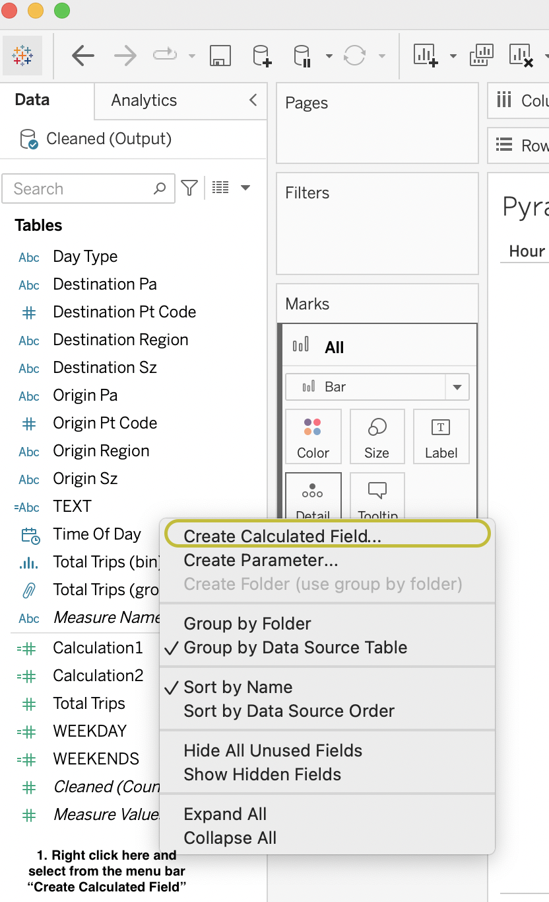
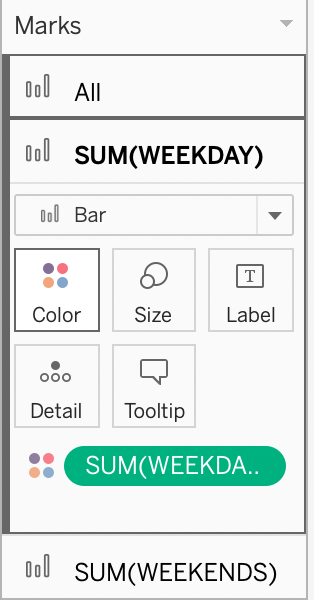
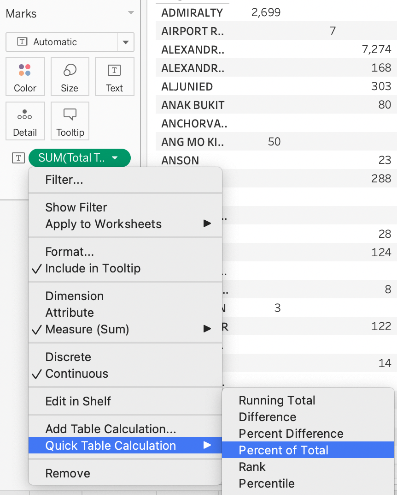
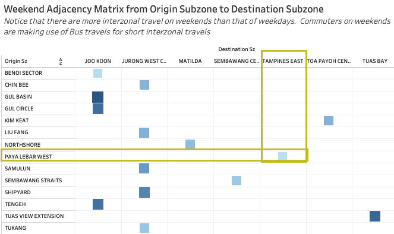
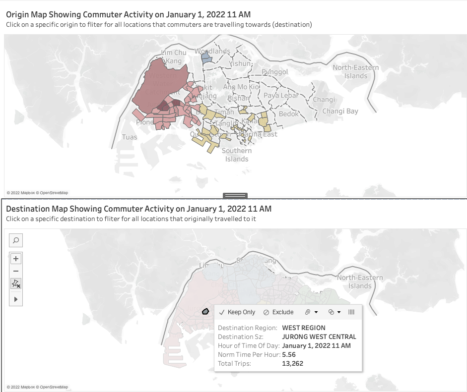

```{r setup, include=FALSE}
knitr::opts_chunk$set(echo = FALSE)
```

# The Task

Firstly, to critic the graph based off clarity, aesthetics and interactivity and provide suggested alternatives with reference to an original visualization about the problem. Secondly, to provide an improved version of the visual with the help of sketching as a guideline. Thirdly, to create the improved graph in tableau and provide a detailed step by step procedure. Finally, to provide three major observations revealed by the improved graph.

Overall Created Works for this Task:

1. Main Dashboard : [Main Dashboard](https://public.tableau.com/app/profile/clement8621/viz/DataViz_MakeOver2_Main_Dashboard/MainDashboard)

2. Complimentary Dashboard : [Complementary Dashbaord](https://public.tableau.com/app/profile/clement8621/viz/DataViz_MakeOver2_Complimentary_Dashboard/ComplementaryDashboard?publish=yes)

3. Storyboard : [Full Storyboard of All Dashboards](https://public.tableau.com/app/profile/clement8621/viz/DataViz_MakeOver2_Storyboard_allDashboard/FullStoryofAllDashboards?publish=yes)

*Note : For Complimentary Dashboard, animation would work only on the local tableau version but the tableau public version can be filtered by either dragging the time animation bar or by specific time*

## Understanding the task and the given dataset 

The data set provides reference to inter and intra-zonal public bus flows by the different URA region, planning area and planning sub-zone information aggregated by different times of the day following a 24 hour format on the month of January 2022. The data set also provides a categorical column for the segregation between weekdays and weekend categories. We are interested to analyze the patterns of these inter and intra-zonal public bus flows and to look out for major trends relating to the traffic flow by the different times of the day for both weekday and weekend traffic flows. 

In addition to this data set, we are also provided the Singapore Subzone Planning Map shape file.The "MP14_SUBZONE_WEB_PL", provides URA Master Plan 2014 Planning Subzone boundary map in ESRI shapefile format. This file provides additional granular level of details like inter and intra zonal latitude and longitude.

---

# 1. Critique of Visualisation 

 

The original data visualization is created by tableau using the data provided. However, there are a couple of graphical elements of data visualization that needs to be changed. 

In this section, we will explore these elements and critic the original visualization. We will critic this visualization by weighing the odds between clarity and aesthetics and attempt to classify it into one of the four quadrant provided by [DataRemixed](https://dataremixed.com/2012/05/data-visualization-clarity-or-aesthetics/) as seen below : 


 


However, in this dataviz make over, we will attempt to also critic the visual based on the interactive elements provided. This will guide our decision into the final spot of the quadrant. 
The quadrant will give us good guidelines into what is expected to move the graph towards the quadrant 1 for the best alignment of visuals and interactivity. As of now, the original visualization is placed in quadrant __; marked with an "X" as seen above.


## 1.1 Clarity 

**Clarity** : Represents the "Function" of the graph, being able to portray the intended message. ***"Let me be clear: being clear matters the most, and it’s not even close"***

From the original visualization, the author's intended message is unclear. 

Much of the context is not described in the any annotation or headers well. Much of the information pertaining to the purpose of the visualization is being left out. It makes it hard to answer the question ***What is the primary comparison the chart wants the audience to make?***. 

After some close observation and guess work, it seems like the author wants to show a comparison between location origin and destination sub zone across the times of the day for both weekday and weekend; where the bar plot is a drilled down version of the adjacency matrix. However, this is not all that straight forward due to elements missing from the chart that has affected its clarity. Additionally, the only way to know what the graphs meant were largely guided by the axis titles. Furthermore, we are dealing with dashboards, it is also important that we critic the dashboard overall clarity and how it can improve in sending its message.

So now, lets critic it in terms of clarity:

- **(a) Unclear Axis Information ** : 
    
    * While the graph show to have axis titles, it's axis titles are not clear. Its position in the visual has mislead users in the way they should interpret the graph. The information presented in the titles are also not useful in helping users to understand the unit of measurement. There are also no annotation of axis marks to help guide users in their judgement.
    * Misleading axis 1 : "Weekend and Weekdays" axis titles are located on the side of the chart. This has mislead users into thinking that the y-axis are categorical counts rather than the actual sum of the total trips. 
    * Misleading Axis 2 : "Day type and Time per hour" are badly labelled field labels. Considering the palcement of these labels, it has mislead users into how they should interpret the chart. For example, Day type field label has no indication of its level of grandularity. As such, users would not be able to tell if Weekday and Weekends are the only categorical values. Furhtermore, "Time per hour" never stated if it is on a 24 hour time format as the axis themselves are not fully showing its tick labels; let alone in the right time object format (HH:MM:). Users might be mislead into thinking it can represent some sort of aggregation over over granular level of time. Althought,it might take some extra time for users to understand that they are looking at a 24 hour time format, it is better to improve its elements to avoid this guesswork 
    
    * Misleading Axis 3: The "Origin SZ" of the adjacency matrix show that of multiple destination to differernt "Destination SZ". Users are not aware of either the kinds of locations present in the Origin SZ or Destination SZ category. This not only makes it had to understand interprety the chart message, it might actually render the chart useless in sending a message across. 
    + Instead, it would be more appropriate to : If a facet for weekend and weekday is to be applied, think about creating a chart tht would be able to show 
    
    + As for the adjacency matrix, It would be better if the number of locations presents is reduced, as it would help to better present the information. This brings me to my next point on information presentation. 
    
- **(b) Amount of Information Presented** : 
    * The adjacency matrix on the left clearly has shown too much information. It has rendered the chart unreadable by users. Furthermore, presenting every detail of information in a chart is not appropriate as it clutters the charts and users at this point would rather read the original table instead. 
    + Instead, it would be more appropriate to : Think about how much data to present. Sometimes, it is not necessary to present all 100+ locations. It might be important to just highlight certain pairs of locations to bring up certain trends of the data like top 50 or 20. These trends might highlight interesting Origin to Destination travelling patterns on a specific aggregate level; say across certain time periods. 
    
- **(c) Lack of Helpful Elements** :
    * The graph titles to a certain extend, presents the information needed to introduce what the graph meant. However, in relation to helping users to understand its message, it has not done so.Titles are important for authors to direct their users attention and to provide extra contextual information about the presented graphics. 
    + Instead, it would be more appropriate to : Provide more detailed and concise titles that would provide better context to the graphs. For example, the bar charts on the left could be renamed to "Ang Mo Kio has considerably more commuters on weekdays" and a subtitle could be "A bar chart representing the number of trips over different times of a day for both weekdays and weekends"
    
    
## 1.2 Aesthetics

Aesthetics : Representing the "Form" of the graph, the ability to take on a kind of looks is rather subjective. However, it is clear from both materials that Aesthetics " should only be discussed once clarity has been achieved". The original visual has a form that is symmetric, with labeled axis and guidelines. However, apart from this there are a number of visual elements that can be improved. In addition, For this Data viz make over, notice that we are dealing with a dashboard. As such, it would also be important to critic the overall aesthetic and the form of the dashboard to present the information.


They are as follow : 

- **(a) Data Inking** : Data ink by Edward Tufte: "Data ink ratio is the proportion of the graphics ink devoted to the non redundant display of information". 
  * The inking of the charts are generally all very uniform. Parts of the charts that receive the same level of ink intensity refer to that of the legend, axis titles, titles and field labels. The ticks themselves have lesser inking. Inking is an important aesthetically element as it directs user attention. Having a uniform data inking practice makes it had for users to guess what is the focus element on the chart. It is hard to notice at first glance that there is a color legend for the agency matrix. 
  * Data ink of the tick marks: notice that for both axis y and x there are no tick marks. While the graph provides a certain level of guides using guidelines, it failed to make use of tick marks to highlight these guides.Furthermore, with such cuttered graphical elements, tick lines should be inked properly to highlight information and axis values better to the users. 
  +  It would be more appropriate to : Highlight main titles, subtitles, important information highlighted by annotation and axis titles. We can downplay the ink for legends but the former should be highlighted since we want to reduce eye movement of users when they are looking for information. We can also downplay for the filter titles of the interactive elements, as we want to show users the option for interactivity but it should not be the main focus with the use of the inking 

- **(b) Titles and Spacing Issues**:
  * Previous, we address the problems with the axis titles. In the aesthetic section, it would mainly be pertaining to the problem of axis title positions. "Time per hour" is not appropriately placed as the axis values is at the bottom of the graphs as seen on the left. While this is an aesthetic problem, it too can lead to clarity issues. 
  * Spacing between the charts and its graphical elements are not well spaced. For example, notice that the Weekend axis titles are not fully shown. Furthermore, the x-axis titles for the "Time per hour" field is also not fully displayed. As explained above, this aesthetically issue of spacing can lead to clarity issues when reading the axis. 
  * Spacing between the charts also need to be emphasized, while there is a space constraint, it is important to also know that cluttering your elements can make it hard for users to focus on one chart. Additionally, notice that there are alignment issues on the dashboard between the bar charts and the adjacency matrix. This could be better handled if there are more plans for better spacing.
  +  It would be more appropriate to : arrange the titles in a way that present users the full information. If we need to arrange charts in a dashboard, it would be better to plan the allocation of space based on chart types and information to be presented. It would help improve the focus on individual charts and make it easy for viewing. 

- **(c) Using Colors Appropriately** :
  * Notice that for the charts facet by weekday and weekend, there are no change in colors although they represent different categories of values. For example, the bar colors of the weekend and weekday are both blue. Furthermore, there is no gradient of colors used to represent the different intensity of commuter flow. It is just a uniform set of blue colors representing the values across the different time of the day. 
  * Also notice that while there is a color gradient used to represent the total trips in the adjacency matrix,due to the cluttered-ness of the chart (as explained mainly due to too much information presented), it is unclear from which origin to destination is there more percentage of trips. 
  + It would be more appropriate to : Apply a different distinctive color for values pertaining to weekday and weekend. Create a gradient hue to this set of distinctive color to represent the intensity of commuter flow across the time of the day. This can be done for both bar charts and adjacency matrix to highlight intensity across time and distinctiveness by day type. 

## 1.3 Interactivity 

To critic interactivity, we will be referencing dynamic elements that is in the areas of **Data and View Specific**,**View Manipulation**and **Process and Provenance** in accordance with the interactivity elements as specified in the site: [Dynamics for Visual Analytics](https://idl.cs.washington.edu/files/2012-InteractiveDynamics-CACM.pdf). The dashboard provided interactive elements like that of tool tips, drop down. However, these elements fall short in terms on how they arranged and how they are displayed to the user. Furthermore, we can additionally make adjustments and improves to improve the interactivity elements of the dashboard. In this section we will not only explain the interactivity changes we will make but also how has the existing interactivity features impact the look and feel of the dashboard 

**(a) Data and View Specific** : The idea of this section is mainly to establish the interactivity that will allow an analyst to be flexible with the data. To have the necessary options to :

- **(1) Explore Large Datasets with appropriate controls** 
  + The sample dashboard provided filters in a single selection in a list format. This is a good filter for users that are looking to filter for a particular origin to destination. However, the filter is not integrated. For example, clicking on Origin SZ only filters the Origin bar charts and clicking on Destination SZ only filters the Destination bar charts. The filters did not include that of the adjacency matrix. 
- **(2) Derive insights from data**
  + Given the un-integrated filters, it is difficult for the user to drill on any particular analysis. This is further hindered by the clarity of the tooltip. Yes, tool tips provide a good way for interactive annotation for users to view details that would otherwise be not on the chart. However, the tool tips themselves are not labelled with the right format.For example "Time Per Hour: 15:00" would be much clear than "Time Per Hour: 15". Insights are also hard to be derived from that of the adjacency matrix as it lacks the tool to drill down or to be filtered. 

 
**(b) View Manipulation** :

- **(1) Select and Coordinate** 
    + Select refers to the pointing of an item or region of interest if wanted. It should be highlighted to show the user that this is the object of interest. Coordinate instead is the idea of integrated parts. The analysis problems should use coordinated multiple views to enable the analyst to see data from multiple aspects. While the sample dashboard allow users to select items, it has no coordinated view. The lack of integration between charts hinders the interactivity of coordination and having such a feature would allow the analyst to perform comparison analysis. For example, Click on Origin SZ bar chart did not filter that for other charts, this fails the use of interactive integrated highlighting. Instead it would be more appropriate to :Providing more variety of charts with integrated highlighting to show origin to destination flow with integrated filters and interactivity would greatly improve the sample dashboard.
    
- **(2) Navigate** 
  + Navigate relates to the idea of "visual information seeking mantra". The idea is to allow users to view an overall before drilling down further into specific locations. The sample dahsboard provided an adjacency for overall view (but as explained it was too cluttered and is rendered useless at presenting information) As, there are many locations, the drill down part can be interactive tabs where graphs are segregated between two different dashboards to allow for different level of granularity for analysis when needed. 

**(c) Process and Provenance** 
  - **(1) Guide ** : Guide, is a combination of good annotation and story telling. For example, a simple workflow might remove sorting and only present a selected few data points. However, as an analyst is it important to develop strategies that are formalized to guide new comers. This portion of interactivity is the idea of providing information through interactive elements and annotation. For example, an annotated text can point to a particular location while a map view can be animated. Furthermore, a slider can be used to allow users to toggle back and forth to adjust for the information as explained in the annotation. This simple combination of elements is a good blend of both context clarity and interactivity. 


### The verdict 

The sample dashboard provides simple interactive elements like single selection list filter. However, it fails to provide interactive elements that are integrated as explained. Furthermore, these interactive elements has hindered its aesthetics and clarity. As for aesthetics, the graphs clearly lack in aesthetics, it does not have enough elements to highlight information or provide any visual comparison at all. It sticks to only one color hue (bar charts) and a poor choice for gradient colors for the adjacency matrix. As for clarity, the bar charts do show origin sub zone trips generated and Trips attracted to destination sub zone but it failed to provide any information at all for the adjacency matrix. The chart in my opinion would be placed in Quadrant 3. 

 


# 2. Sketch Of Proposed Design

 

 

 

 

 

 

# 3. Data Preparation

The data provided is as shown :  

## 3.1 Step by step data preparation and issues 

In this section we need to create the format in which Tableau can use to read and apply the appropriate aggregation methods. We will first explain the data issue faced and explain the step by step procedure on how we over come this problem and better prepare the data. 

For data preparation, we will utilize **Tableau Data Prep**.


### Setting the Goal

Reproducibility is an important factor when documenting your analysis. Others who view your blog post should be able to follow the step by step clear instructions to reproduce your work. It is also important to provide the explanation for each step. This allow others to understand why certain actions are needed. Before diving into the data preparation sections, we will first introduce a few interface terminologies that is used throughout this article explanation. We will do this by walking through the few basic steps needed to set up the interface to begin the data preparation process.


### Basic Set up and Introduction 

[Tableau Data Prep](https://www.tableau.com/products/prep) is a rather straight forward tool with drag and drop features that can seamlessly integrate into a pipeline for data cleaning and preparation purposes. To begin, we will:

1. **import** a data set into user interface by either dragging the file onto the platform or by clicking the "Connect to Data" button highlighted in orange; followed by the '+' icon on the upper left corner of the screen under the connections card and click on excel to navigate to the file using the file explorer pop up. 

2. Once successful, the data will appear on the same section as the "connections" column. 

```{r echo=FALSE, fig.cap = "Connecting To Dataset"}
#
```

Once the data is loaded, we will proceed to add a clean step card. To do so, we will proceed by clicking on the "plus" icon beside the data card and then click on "Clean step". This will add a clean step to allow for data cleaning procedures to begin. This is seen in the image below : 

```{r echo=FALSE, fig.cap = "Connecting To Dataset"}
#
```

#### Data Issue 1 : Column Data Type

##### Column Data Type of Time_of_Day

Note that the "Time_of_Day" column is not in data time format. It is a good practice to ensure that columns are in the right data type to allow for a better data quality standard. This column can then be drilled down into hours in tableau. 

1. We will "Create a calculated Field" by first right clicking on the three dot icon along the bar 

```{r echo=FALSE, fig.cap = "Creating a Calculated Field"}
knitr::include_graphics(file.path(here::here(),"_site/DataViz/DataVizMakeOver2/images/cleaning","createCalculatedField.png"))

```

2. Once we have entered the calculated field pop up, we will proceed to create the calculated field formula. As we want to create the date time format, notice that the front and back of the "Time_of_Day" column does not have "00:00" and also the "YEAR_MONTH" column is not in complete format of : "YYYY-MM-DD" instead it is in "YYYY-MM". As such, the following formula  and rename the column as seen below:

```{r echo=FALSE, fig.cap = "Formulae to Format the New Column 'Time of Day' "}

```


#### Data Issue 2 : Removal of Redundant Columns

Note that there are two columns whose value are consistent. The first is "PT_TYPE" and the second is "Year_Month". Notice that for "PT_TYPE" the value is only "BUS" and for "YEAR_MONTH" is only the value "2022-01". We can also notice this from the tableau prep distribution of column values. 

To remove a redundant column : 

1. Hover over the columns we do not want, click on the options icon. For our case we will just click on the remove. This will remove the column from the data table. We will perform the same step for both column. The steps are illustrated below : 
  

```{r echo=FALSE, fig.cap = "Removing of Redundant Column PT_Type "}

```

```{r echo=FALSE, fig.cap = "Removing of Redundant Column YEAR_MONTH "}

```

#### Data Issue 3 : Removal of Null Values 

Notice that in the columns of Origin SZ and Destination SZ there are rows with missing values. This will result in a mismatch in rows; where some have origin SZ with blank destination SZ and Vice Versa. This is illustrated in the orange box in the image as seen below : 


```{r echo=FALSE, fig.cap = "Missing Value Investigation "}

```

Notice that in the rows with the null values, there are null values in the rows of "origin" and "destination" columns. As such, for all rows with null values, we will apple a filter to remove them. The following illustrates the step. 


1. We will hover over the three dot icon for the menu bar with the option for filter

2. We will click on filter "NULL values". This will remove all null values rows in that column only. To rid of all null values in the data set, we will have to apply this method to all columns of "origin" and "destination"


```{r echo=FALSE, fig.cap = "Missing Value Filtering out"}

```


#### Exporting the output 

After all the above step, the data cleaning cart work flow should be similar to that below : 

```{r echo=FALSE, fig.cap = "Missing Value Filtering out"}

```


After which, we will go ahead and add a new output card to output the data to excel sheet. We will first add a output card by clicking on the plus button before entering the details of the output. We will set the output to an excel sheet called "Cleaned". This is illustrated in the images below : 

```{r echo=FALSE, fig.cap = "Adding an output step"}
knitr::include_graphics("./images/cleaning/AddOutputStep.png")
```

```{r echo=FALSE, fig.cap = "Output details as explained"}

```


# 4. Step by Step Building the Visualization

The first step is to import the clean data over to tableau.

1. Start a new tableau page and drag the "Cleaned.xlsx" file on to the plane. Your view should be similar to that as seen below : 

```{r echo=FALSE, fig.cap = "Output details as explained"}

```

# 4.1 Time Series Bar Chart 

In the first take home exercise, we explored the creation of the population pyramid. The population pyramid have a couple of important aspects that are deem to be applicable to the current problem. The original intent of the user using the bar chart is to allow the user to be able to compare between the different day types of "weekend" and "weekday" across the different times of the day. The population pyramid in this case, would share the same direction and purpose of visualization as the author using the bar chart. The population pyramid will allow us to compare the different types of the day between the two day types in a horizontal orientation of comparison. Population pyramids are often used by demographers typically to study the trend of populations relating to the fertility and mortality of populations. The visual effect of the population pyramid is what would suit this problem. However since, this is a time series data, we will flip the chart to make it horizontal. The pyramid chart would allow for the graphical representation to understand the composition of travel outflow across the different times. This would allow for a good comparison between "weekday" and "weekend" travel outflows for a particular origin or destination sub zone.  

To create the pyramid charts for the travel outflows we will follow the following steps : 


1. Create calculated field for Weekends and Weekdays. The idea is that we will need to format for values on the same axis that have values for either weekends or weekday. To perform this : 

  1. First is to right click on the column plane to create a calculated field
  
```{r echo=FALSE, fig.cap = "Create Calculated Field"}

```
  
  2. To set the formula to derive values for weekends only and weekdays only. To do, the following calculation is made as seen below : 
  
```{r echo=FALSE, fig.cap = "Weekday Formulae"}
knitr::include_graphics("./images/Building_Chart/pyramid/weekday_formulae.png")
```

```{r echo=FALSE, fig.cap = "Weekend Formulae"}

```

  3. After setting the formula, we can drag both of these over to the row plane. Notice that doing so, will create line charts. We can change the chart type by clicking on the "ShowMe" and changing this over to a barchart type.  
  
```{r echo=FALSE, fig.cap = "Dragging to Row Plane and ShowMe to Barchart"}

```  

```{r echo=FALSE, fig.cap = "Result"}

```  

  4. Doing so will produce the charts as seen above. To make the barchart to be back to back, we will have to edit the axis and reverse the axis. To do so, we will right click the axis and edit it. After which, we can then reverse the axis scale as seen below :    
  
```{r echo=FALSE, fig.cap = "Edit Axis"}

``` 
  
```{r echo=FALSE, fig.cap = "Edit Axis"}

``` 


3. After reversing the scale, we then add color to the chart. To differentiate between the different day type, we will add the calculated field we have created : "WEEKEND" and "WEEKDAY" over to the color marks for each of marks card that was created separately for the different row plane of "WEEKEND" and "WEEKDAY". To do so, we will just have to drag the columns of "WEEKEND" and "WEEKDAY" over to their appropriate color marks 

```{r echo=FALSE, fig.cap = "Color Gradient"}

``` 

```{r echo=FALSE, fig.cap = "Color Gradient Result"}

``` 

We can further improve the color scheme of the charts by editing the colors. Right click the color marks and click on edit colors. We will adjust the color only for the weekend as we want to visually let the users know that these two are differnt day types as explained earlier. We will proceed to color grade them differently. 

```{r echo=FALSE, fig.cap = "Adjusting the Color Gradient"}

``` 

After which, we will proceed to add a reference line to let the users be able to identify the trends easily from the bar chart. We will proceed to create reference lines using the quantiles  We will want to be able to see the timing that are way above the median and the upper quantiles. To do, we will right click the x-axis and add reference line. After which, we can then change the reference line type to distribution and select the computation option for "quantiles" with a 4 bands; which will refer to 25%, 50%, 75% and 100% respectively. 

```{r echo=FALSE, fig.cap = "Adding a Reference Line"}

``` 

```{r echo=FALSE, fig.cap = "Reference Line set for Distribution with Quantiles"}

``` 

To avoid the clutters of the reference line bands, we will proceed to remove these labels by setting the label option to none.

```{r echo=FALSE, fig.cap = "Removing the Label of the Reference Line"}

``` 

The final result would look as such : 

```{r echo=FALSE, fig.cap = " Bar Chart for Trips Generated"}

``` 

```{r echo=FALSE, fig.cap = " Bar Chart for Trips Attracted"}

``` 

We can further flip the rows and columns to create a chart that is more suited for a time series analysis which is increasing in time by the x-axis. We will do so by bringing "Hour" to columns and "Sum(Weekday) and Sum(Weekend)" to rows.

```{r echo=FALSE, fig.cap = "Flipping the Axis"}

``` 

and the final charts are seen below :

```{r echo=FALSE, fig.cap = "Final Bar Chart for Trips Generated"}

``` 

```{r echo=FALSE, fig.cap = "Final Bar Chart for Trips Attracted"}

``` 


4. Adding in the Filters

The author combined all these graphs into the dashboard and to prepare for the dashboard to have integrated filters, we will proceed to drag the "Origin sz" and "Destination sz" over to the filter first. After which, we can "Right click" on the filters to add these chart to context. The purpose of this is to integrate the charts to be filtered by other charts that use global fliters. This would be useful for the integration with the adjacency matrix which will be explained in the next section. The steps to add these filters would be as such 

1. Drag the "Destination sz" or "Origin sz" column over to the filter card and right click "Add to context option" 

```{r echo=FALSE, fig.cap = "Add to Context for Origin SZ"}

``` 

```{r echo=FALSE, fig.cap = "Add to Context for Destination SZ"}

``` 

2. For each of the filters, click on the "All" option to set the initial filter to "All" first.

```{r echo=FALSE, fig.cap = "Accept the All option for Filters"}

``` 

**With that the pyramid bar chart is created and is ready for filter integration.**

# 4.2 Adjancency Matrix

Adjacency matrix are often used in network theory for the representation of node relationship. It is a square matrix used to represent a finite graph. The elements of the matrix indicate the quantified relationship between pairs of vertices. The author used the adjacency matrix to quantify the relationship of between origin and destination. There are two matrix in which the author has used to show the outflow (origin-destination matrix) and the inflow (destination-origin) matrix. However, as criticized the adjacency matrix presented by the user is shown to be difficult to yield any finding at all with that level of granularity. It would be great to show the top few pairs of location where the inflow and outflow patterns contain a high percentage of travels. 

To do so, we will create binning of values for the "total trips columns" This will allow us to filter for the top location with high number of outflow or inflow. The steps below would show the creation of the chart for one of the adjacency matrix (outflow). The creation of the inflow matrix is the same just switch the column value from Destination sz" to "Origin sz" and row value from "Origin sz" to "Destination sz"

To create the adjacency matrix the following is done : 

1. We will create the base chart. For the chart itself, we will have to drag to "Origin Sz" and "Destination Sz" as the axis of the graph. Next, we get the sum of total trips as per the values in the table. With this, we have created our base chart.


Next, we will update the values in the table as percentage of total of the whole table. We can do this by going to over to the variable in them marks card under the text marks for "Total_Trips" and perform a "Quick Table Calculation". We will then process to change the calculation following table across. With this, the final table will be in filled with percentage values across in accordance with the row of the table.




Next, we will add filters on the table using the "Total Trips" and show this filter.


* Do note that in this chart the variable is "Total Trips (Group)". However the actual varaiable we are using is just "Total Trips".

We will then convert this table into a heatmap using the "Show Me" function as explained before. We will then adjust the width of the heatmap.


Now, we will update the color of the heat map and add annotations to highlight the different levels of total trips across different locations. We will also increase the view of the chart to "Entire View"

With that the final adjacency matrix is as shown below.


# 4.3 Animated geographic Heat Map 

The aim of this animated geographical heat map is to show the peak sub zones in Singapore that are popular origin location and destination location by time. It shows the shift in "hot zones" at each time of day. Additionally, both destination and origin geographical map can be used as filters to understand where commuters come form and go to, respectively. 


To build this dashboard, we will first generate a normalized trip sum, followed by creating the "Animated Destination Geographical Heatmap", the "Animated Orgin Geographical Heatmap" and finally, the dashboard. 

First, we will have to create a Calculated Field, "Norm Trips Per Hour". This field will help us to filter "Total Number of Trips" by each geographical region, subzone and time period. With this, we can create the animated chart with a varying colour scale.


Now, we will create the base of the "Animated Destination Geographical Heatmap". We will use "Geometry" measure under "Destination Map" table. This will plot the base geographical chart based on Singapore's map.
 

Next, we will perform the following steps:
1. Create a map overlay by using "Dual Axis" (Black Box).
2. Include the relevant chart details ("Destination Region", "Destionation Sz" from "origin_destination_bus..." table), which are the identifier of the aggregated records by region and sub zone (Pink Boxes). 
3. Include "Time Per Hour" into "Pages" segment to enable the animation by Time of day (Red Box).

 
Next, we will replace the overlay Co lour by using the calculated field, "Norm Trips Per Hour" as the color value in the second marker block. We will then update it to gray scale with an opacity of 51%.

 

 

 

We will then add "Total Trips", aggregated with a summation to display the actual number of trips originated form the Sub zone. To complete the chart, we will update the chart name to include "h" behind "Time Per Hour" which is "<Page Name>". Do remember to change the sheet name to "Destination".

 

 

With this, we are done with creating the "Animated Destination Geographical Heatmap". 

To create the "Animated Origin Geographical Heatmap", all we need to do is repeat the above steps and replace "Destination" values to "Origin". For clarity, perform the following changes to the above steps: 

1. Extract the "Geometry" value from "Origin Map" table instead of "Destination Map" table
2. Replace "Destination Region" and "Destination Sz" to "Origin Region" and "Origin Sz" from the same table.
3. Replace sheet name from "Destination" to "Origin"

# 5. Bringing it All Together 

1. Main Dashboard : [Main Dashboard](https://public.tableau.com/app/profile/clement8621/viz/DataViz_MakeOver2_Main_Dashboard/MainDashboard)

2. Complimentary Dashboard : [Complementary Dashbaord](https://public.tableau.com/app/profile/clement8621/viz/DataViz_MakeOver2_Complimentary_Dashboard/ComplementaryDashboard?publish=yes)

*Note : For Complimentary Dashboard, animation would work only on the local tableau version but the tableau public version can be filtered by either dragging the time animation bar or by specific time*

## 5.1 Building the Final Dashboard

The original visualisation places these charts into a dashboard. However, we will want to re-arrange these charts into with greater interactivity and ease of use.


In this make over, the key changes are the bar chart looking similar to a population pyramid. This is done to show the similarity and differences between the peaks between weekend and weekdays. The y-axis is marked with different maximum y-axis value to compare the relative peaks between weekends and weekdays instead of the absolute values. The bar charts can be filtered by a drop-down list on the right of the chart.


The adjacency matrix is filtered based on percentage of total of the given origin, albeit not linked to both charts (each chart has it’s own filter).

Next, the adjacency martix is used as a filter for the bar chart, in which case when a use hovers over the origin/destination labels, or the square in the matrix itself, the bar plot will be filtered accordingly. This was created using an the “Action” function in the software.


Next, with the creation of both animated geographical heatmap, will we will put together in a dashboard. We will stack the dashboard, with the "Animated Origin Geographical Heatmap" being above the destination heatmap. Then, we will select "Use as filter" for each chart to enable users to interact with it and identify respective origin and destination points to and from the selected destination or origin.


# 6. Major Observation

- **(1) ** At higher percentage of total trips from origin to destination for both weekend and weekdays, it seem that bus commuters are using this form of transportation for intra-zonal travel. For example, at the 65% to 100% percentage range, notice that there are trips from nearby to the central regions of that location. It also represent short distance travels like that of (GUL Basin to Joo Koon where more than 90% of trips from GUL Basin is to Joo Koon  ) and (GUL Circle to Joo Koon where more than 90% of trips from GUL Circle is to Joo Koon); locations nearby to that of Joo Koon. Additionally, other towns have similar activity like that from ( Tuas View Extension Area to Tuas Bay where 90% of trips travel from Tuas View Extension Area to Tuas Bay). Interestingly, these location with high percentage bands across show to be areas from that of the West. 


We can further investigate these points and understand how is the traffic like more specifically by the different times of the day. We will take the example of Gul Basin to Joo Koon origin to destination pair. 


First, hover the adjancy matrix for the row and GulBasin and Joo Koon. The dashboard will auto filter the bar charts as seen. For the trips generated from GulBasin to Trips Attracted to Joo Koon overall. Notice that from Gul Basin, the total trips start to peak above the 75 percentile at 07:00hrs and that of 16:00hrs to 18:00hrs. Additionally from that of Joo Koon, there are two peaks at two timings above the 75 percentile, we have a peak at 0700hrs and that the hour of 17:00hrs and 18:00hrs . The patterns for both of these location closely resembles that of each other and show the zone travelling relationship between these locations. It is likely that Joo Koon is the central location of the west region serving commuters in these areas. We can further investigate these using the geographical map view as seen below : 


Notice from the above map, we have filtered it by Joo Koon on the destination map to filter for location that travelled from certain origins as reflected on the origin map. Notice that across the different times, the regions travelling from and to are fairly concentrated around the outskirts of the west region. This shows Joo Koon important as a central transportation destination for bus commuters; likely to change transportation type. This brings me to my second finding 

- **(2)** From the geographical animated map, notice that are dark colored spots at certain throughout certain timings. This animated map provides a good overview of the travel patterns of Singapore commuters by Bus over the times of the day from Origin to Destination. Coincidentally these dark colored locations are consistently found at locations that are central to the region. It was also noticed that the dark colored spots are highlighted in pairs and this shows the similar level of activity between certain central parts of the region. We will pick the examples according to the identified peak hours across all locations 


This chart was created for investigative purposes to understand the timings that fall out above the 75 percentile. This will tell us timings where commuters zonal travel patterns are vastly different from the rest of the 75% time bands. We can notice from this chart that there are two time bands where the travel patterns are vastly different. To simplify the example, we will pick the peak of hours that fall above the 75% for either the  morning, afternoon or and evening peak for Weekdays. For weekday, this is the hour of at 7am and that of 6pm. These timings indicate extremely high commuting activities which falls into the category of peak hours. Note that the finding is also consistent for weekend. 


Notice that these are just some of the locations highlighted. Interestingly these location are usually highlighted with other parts of the region with similar travel activity. These are highlighted below. The findings are consistent for weekends. 

Example of Similar pairs of locations within the region

1. East Region : Tampines East and Bedok North

2. North Region : Yishun West and Woodlands Regional Center

3. West Region :Jurong West Central and Hongkah

4. Central Region : Tao Payoh and Aljunied 

This shows how important bus transportation is for commuters looking to travel to more central regions of the respective regions. These locations also happen to be central transportation hubs which facilitate other forms of transport like the MRT. 

- **(3)** There is a difference in travelling patterns between "Weekday" and "Weekend". Through the first insight, we can see that while bus travels are often used for intra-zonal travels, it is noticed that for weekends, the intra-zonal travelling percentage for the same set of locations are lower and at the same percentage band include that of more inter-zonal travel. For example, in the first insight we highlighted the percentage band on the adjacency matrix at 65% to 100%. Notice that on the weekend, there is a pair of location from (Paya Lebar west to Tampines East with 65% of trips generated from Paya Lebar west to Tampines East) as seen below : 


If we expand the band further, we will notice that more and more inter-zonal travel is present. We can also use the animated map to depict this finding for example. We will use the location of Jurong West ( central of the west region as established in the previous section). For the example, notice that on weekday, the darker regions present journey from more "intra-zonal" parts of the region. But for the weekends, these regions become lighter indicating that these activities have dropped off and the intensity have spread to other regional areas (with slightly darker intensity of color). 





Overall, this shows that weekend and weekday have similar uses of bus transportation for intra-zonal travel but the uses for intra-zonal travel is more for weekday than weekend.

We will attempt to can further illustrate these findings further into a story board. In which all dashboards created would be presented in the storyboard. The full story board can be found here:

Storyboard : [Full Storyboard of All Dashboards](https://public.tableau.com/app/profile/clement8621/viz/DataViz_MakeOver2_Storyboard_allDashboard/FullStoryofAllDashboards?publish=yes)

Users will first be greeted by the overall time series bar chart before navigating to the main dashboard or complimentary dashboard


