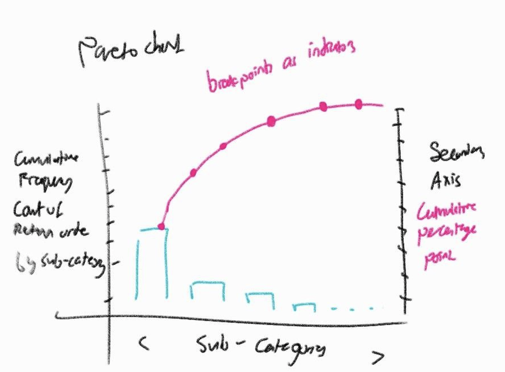
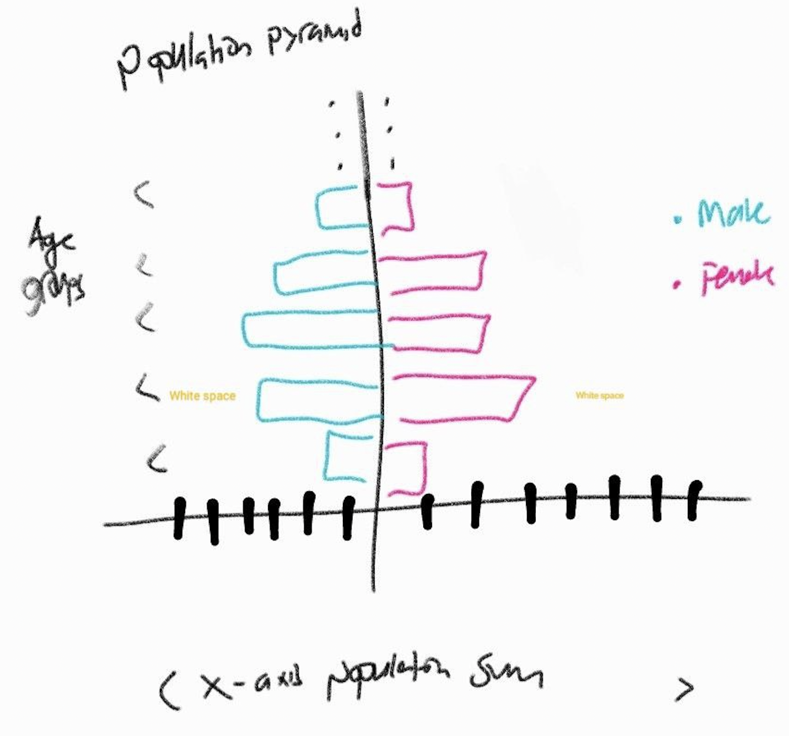

```{r setup, include=FALSE}
knitr::opts_chunk$set(echo = FALSE)
```

# 1.0 Introduction

## 1.1 Overview 

This take home exercise is to explore the creation of two graphs programmatically, using R. Two datasets and graphs will be generated in this exercise.

The first case study aims to identify the "vital-few" categories with a high number of return orders from consumers of an [American Super Store](https://community.tableau.com/s/question/0D54T00000CWeX8SAL/sample-superstore-sales-excelxls) using a **Pareto Chart**. This visualization helps the Super Store to identify the "vital-few" categories which results in high cost due to a high number of return orders.

The second case study aims to understand the age-sex population structure of [Singapore](https://www.singstat.gov.sg/find-data/search-by-theme/population/geographic-distribution/latest-data) using a **Population Pyramid**. This visualization helps Singapore's government to curate policies targeted at the type of structure that exists in Singapore

More details pertaining to the data and graphs will be explained in later sections.

## 1.2 Proposed Sketch and Inspiration 
These sketches were inspired by visualizations created on Tableau.

### Pareto Chart

A Pareto chart is a bar graph with a cumulative frequency plot. The bars are arranged in a decreasing frequency from left to right to highlight significant categories. In the context of the American Super Store, the bars represent the total number of return orders (frequency).



### Population Pyramid 

A population pyramid shows the distribution of a population by age groups and sex. The term pyramid is used to depict a growing populaiton, which most countries hope to achieve. In the context of Singapore, this population pyramid will depict Singapore's population distribution and the colors, blue and pink will be used the males and females respectively. 



# 2.0 Required Libraries
This section provides a summary of the packages required for this exercise. 

* [**readxl**](https://readxl.tidyverse.org) : Package made easy to read excel into R   

* [**tidyverse**](https://www.tidyverse.org) : A collection of core pakages designed for data science in R 

* [**kableExtra**](https://cran.r-project.org/web/packages/kableExtra/vignettes/awesome_table_in_html.html) : Package used for table generation and simple table output designs

* [**knitr**](https://cran.r-project.org/web/packages/knitr/index.html) : Package used for dynamic report generation

The following code chunk will check if the required libraries are installed first before loading them into the R environment.

```{r message=FALSE, warning=FALSE, echo=TRUE}
packages = c('tidyverse', 'readxl','kableExtra', 'knitr')
for (p in packages){
  if(!require(p,character.only = T)){
    install.packages(p)
  }
  library(p, character.only = T)
}
```

---

# 3.0 Case Study 1  : Superstore Dataset


## 3.1 Overview and Dataset

The Super Store [dataset](https://community.tableau.com/s/question/0D54T00000CWeX8SAL/sample-superstore-sales-excelxls) contains data on order details of customers' orders of a superstore in the US. This includes order, return and shipping information. This case study, will conduct an [**analysis of returns**](https://www.blog.shippypro.com/the-importance-of-return-analysis-for-your-e-commerce/). This analysis aims to understand the return of a product type to provide the management with information as to which products require further investigation on the reason(s) why these products are being returned. Analyzing such data can help examine possible weaknesses in the products or to provide a better service to customers. Additionally, returns in a product translates to monetary losses and a lack of consumer confidence in the company. Thus, this analysis will provide the Super Store with a better understanding on which products requires more attention from them.


### The Task 
Build a pareto chart showing the distribution of returns by product sub-category of this super store. 

### Understanding the task

The pareto chart, created by the creator of the "80/20" rule (Vilfredo Pareto), is a good visual for this case. It was created with the goal to **show the effects of losses based on different causes**. One can visualize the "20%" that is the most critical. 

In this case, factors/categories represented by "taller" bars will on the most left will have the most importance. A cumulative percentage line plot will give added judgement guidelines. The transition point on the cumulative line plot will be the "vital few" point. This is because, the set of categories identified before the vital point can help management teams to drill-down and easily identify the more major factors contributing to losses (returned orders). 

More use cases can be found [here](https://blog.minitab.com/en/understanding-statistics/when-to-use-a-pareto-chart) 

---

## 3.2 Dataset Challenges
The following are the data challenges faced: 

1. We need to join the data frames because the data table are normalized into different tables. Yet again, joining this data set is more flexible in R as oppose to tableau because you can join on keys that you specify instead of having to edit auto selected keys. 

2. We need to do some data wrangling to count the number of returned orders by sub-category (frequency) for the vertical bar plot and to calculate the cumulative frequency column for the y-axis. From there, we need to also calculate the cumulative percentage points for the line plot 

3. Notice that while age cohorts is a factor data type, we know that there is a order for the different age groups. Thus, we need to apply ordered factor function to let R know that there is a certain order to the category of these different age cohort. 

4. Chart customization parameters like ticks and labels are not yet set up.

5. We need to explore ggplot2 complete `themes()` and geom objects like `geom_segment` and `annotate` functions to improve the visuals and customize the chart respectively. 

## 3.3 Data Preparation 

#### Reading the data

```{r warning=FALSE, message=FALSE, echo=TRUE, results ='asis'}
orders <- read_xls("./data/Sample - Superstore.xls", sheet='Orders')
returns <- read_xls("./data/Sample - Superstore.xls", sheet='Returns')
```
Observations: 
- Data tables pertaining to the order and return information exist in different sheets. So, we need to read in two sheets. 
- Also notice, that '.xlsx' is the file extension which equates to excel format. As such, the **readxl** library, particularly the `read_xls` function would be used to read in the data. 

Orders have a total of *17 columns* to just show that they have a common column, i will only select the first three for illutration purposes. `orders` table on the left and `returns` table on the right

```{r echo=FALSE}
orders_head <- head(orders[1:3])
return_head <- head(returns)
knitr::kable(list(orders_head,return_head))
```

We will need to join the `tibble` dataframe of orders and return. We can do so using `dplyr` library join functions. The following code chunk uses a left join between returns to orders on the common key: `ORDER_ID`. The idea of a left join is that since we join the tables with returns first, and, we are concern with returns, we will left join returns to orders. 

```{r warning=FALSE, message=FALSE, echo=TRUE}
join_table <- left_join(returns, orders,
                        by = c('Order ID' = 'Order ID'))
kable(head(join_table[1:5]))
```

However, we need to check if there are order ids that exist in returns but not in orders - there technically should not be the case

```{r echo=TRUE}
# number of rows filtering for rows with more 70% of data missing
join_table[rowSums(is.na(join_table)) >= 0.7,]
```

The returned `tibble` dataframe have 0 rows returns and so the data have no missing data after the left join. Now we may begin to do some data wrangling. 

### Data Wrangling 

The code chunk below does the following as described: 

1. We will group the return orders by sub-category and then count the number of return orders in each of the sub-categories respectively using the `group_by` and `summarise` function. 

2. We will then sort in descending order where the largest value will represent the most left factor (Factor with the highest frequency) using the `arrange()` function with `desc()` function to sort the frequency by decending order. 

3. Lastly, `mutate()` function will be used to calculate the cumulative frequency and the cumulative percentage points.

4. `Ungroup()` always if you group 

```{r echo = TRUE, message=FALSE, warning=FALSE}
# Creating Pareto dataframe 
pareto_df <- join_table %>% 
                group_by(`Sub-Category`) %>% 
                  summarise('Returns'=n()) %>% 
                  arrange(desc(Returns)) %>%
                  mutate(cumfreq = cumsum(Returns)
                         , cumperc = cumfreq/nrow(join_table) * 100
                         , per = Returns/nrow(join_table) * 100) %>%
                      ungroup() 

knitr::kable(pareto_df)
``` 

Notice that I have included the `per` (percentage) column as it will give us a clear idea of the percentage each sub-category contributes to the whole. I have also explained why i would need cumulative frequency and cumulative percentage points for the pareto chart earlier. 

Now with the dataframe build for graphical representation, we will need to factorise the sub-category to ensure that R understands the different levels in the sub-category column and its order. The following code chunk show how the `factor` function will be used to set this level and the order of the sub-categories. This is a neat trick to set the order the bars in place. 

```{r echo = TRUE, message=FALSE, warning=FALSE}
# ordering the sub categories as factors 
pareto_df$`Sub-Category` = ordered(pareto_df$`Sub-Category`
                                   , levels= unlist(pareto_df$`Sub-Category`, use.names = F))

factor(pareto_df$`Sub-Category`)
```


## 3.4 Building the Visalisation 

### Building Graph Ticks 

To build a visualization, it is important that the graphic is tailored for the audience such that it brings the intended message across. Notice that while we have prepared the values that will be used on the pareto chart, we need to create more variables to customize the chart. 

The following code junk creates the neccessary variables for chart customization :

1. `N` is the sum or total number of return orders can be used to help set limits and adjust our ticks  

2. `y2` is the secondary y-axis label representing the percentage points that will be used for the pareto line chart cumulative percentage points

3. `nr` is the number of rows in the Pareto data frame, used to adjust the secondary y axis `geom_segment` object because the geometry object (`annotate`/`geom_segment`) needs to be after all the unique sub-categories.

4. `Df_ticks` contain the data frame that have three columns. Each of this column will represent the coordinates that will be used to help construct the secondary axis using geom segment object. 

```{r echo = TRUE, message=FALSE, warning=FALSE}

N <- sum(pareto_df$Returns)
y2 <- c("  0%", " 10%", " 20%", " 30%", " 40%"
        , " 50%", " 60%", " 70%", " 80%", " 90%", "100%")
nr <- nrow(pareto_df)
Df_ticks <- data.frame(xtick0 = rep(nr +.6, 11)
                       , xtick1 = rep(nr +.8, 11), ytick = seq(0, N, N/10))
kable(head(Df_ticks))

```


### Building the Pareto Chart

To build the Pareto chart there are a few components and geom objects we need to be familiar with.  The core components come from the ggplot2 library. It's uses in this segment is explained as follows:

- `geom_bar()` : used to create bar plots. It makes use underlying function `stat_count()` which counts the number of cases at each x position. In this case, the number of returned orders for each sub-category 
    + Note that this should not be confused with `geom_col()` which uses `stat_identity()` instead. 
    + Essentially the two are the same if i use `geom_bar(stat="identity")`
    
- `geom_path()` :  connects the observation in order in which they appear in the data. This function will help to connect observations in original order. A line chart would be drawn over the sub-category representing their cumulative frequency.
    + Note that this is different from `geom_line()`. `geom_line()` instead connect observations in order by the x value in the data.
    + More can be found [here](http://www.kaiyin.co.vu/2014/05/ggplot2-difference-between-geomline-and.html)
    
- `geom_point()` : We will be using geom point to create a dot plot plotting the sub-category by cumulative frequency.

Knowing the components of a Pareto chart, we can start to work on the parameters of these objects. The usage of parameters are as described below:

- [aes (aesthetics)](https://beanumber.github.io/sds192/lab-ggplot2.html#Geometric_Objects_and_Aesthetics) : this parameters maps a visual cue to a variable. Some of these include specifying the x and y axis values, fill (inside), color, position.
  + For our case, we will adjust these parameters to help with with the graphical output 

- `scale_y_continuous()` and `scale_x_discrete()` : used for scaling of the number of breaks (for y axis) and the x sub-category labeling 

- `guides()` : are extra labels like legends that can be used to give more information. We will be removing this as we do not have mutliple facet categories or color coding. Thus will not be neccessary. We will instead make do with a secondary axis using geom_segment (segmentation) to customise the chart 

- `annotate()` : allow you to add all kinds of shapes or text you want to your graph
    + Note: annotate is a simplier and more efficient alternative to reduce code length when wanting to add extra graphical components to the graph 
    + 2 annotations were added to the graph, one is to create a rectangle of white background for the text space while the other is to create the secondary axis y labels.
    + While we can create a secondary axis using [sec.axis](https://ggplot2.tidyverse.org/reference/sec_axis.html) we are going to create our own.
    
- `geom_segment()` : Draw a straight line as your state the coordinates on the cardtesian plain in which it would appear 
    + the parameters x, xend, y, yend specify where the line will start or end on the x and y axis respectively (using x and y tick column in Df_ticks)
    + below we are using 2 geom segements to create the secondary y-axis line, followed by the ticks line that spans from the secondary y-axis to the text annotation (secondary axis y label)
    
- `labs()` : specifics the labels of the chart , this includes the title, subtitle, x and y axis-titles 

- `themes()` : themes function is a way to customize all non-data display. We will be using the complete theme: `theme_bw()` and further specific the text size of both the x and y axis text and title labels.

Combining the knowledge of this, we will proceed to build the chart.

```{r echo = TRUE, message=FALSE, warning=FALSE, fig.width=9.5, fig.height=4.5}

pareto<- ggplot(pareto_df, aes(x=`Sub-Category`, y=Returns)) + 
  geom_bar(aes(y=Returns), fill='lightblue', stat="identity") +
  geom_path(aes(y=cumfreq, group=1), color="black", size=0.9) +
  geom_point(aes(x=`Sub-Category`, y = cumfreq),color="black") + # pch is typ of pointer 
      scale_y_continuous(breaks=seq(0, N, N/10))  +
      scale_x_discrete(breaks = pareto_df$`Sub-Category`) +
      guides(fill = FALSE, color = FALSE, scale="none") +
      annotate("rect", xmin = nr + 1, xmax = nr + 2, 
               ymin = -.03 * N, ymax = N * 1.02, fill = "white") + # create the space 
      annotate("text", x = nr +1.2
               , y = seq(0, N, N/10), label = y2, size = 2.5) + # create the labels
      geom_segment(x = nr + 0.6, xend = nr+0.6
                   , y = -.02 * N, yend = N * 1.02 , color = "grey50") + # create the line 
      geom_segment(data = Df_ticks, aes(x = xtick0
                                        , y = ytick
                                        , xend = xtick1
                                        , yend = ytick)) +  # create the ticks 
      
      labs(title="Pareto Chart - Returns by sub-category"
           , subtitle="50% of returned orders fall in either the Binders, Paper, Phone or Furnishing Product Sub-Cateogry", 
           x="Sub-category", y="Absolute frequency") +
      theme_bw() +
      theme(axis.text.x = element_text(size=rel(0.75))
            ,axis.title.x = element_text(size=rel(1))
            ,axis.text.y = element_text(size=rel(0.8))
            ,axis.title.y = element_text(size=rel(1))
            )

plot(pareto)

```


## 3.5 Conclusion and Interpretation

From the above pareto chart, vertical bars that arranged in a ranked order with the sub-categories that contributes the most to the number of return orders would appear on the most left. The cumulative line would show the percentage point for each bar starting from the left (highest contributor to return orders). 

As mentioned above, the parto chart would allow us to identify the *vital few* sub-categories that contribute most to the reutrn orders. Notice that slope becomes less steep after the  first four subcategories. This aligns with the idea that if we follow the *80/20* rule, out of 17 unique categories, 20% would represent 3.4 categories.To make things simple, it will be the first four categories. 

The top four categories or these "vital few factors" actually contribute more to the number of return orders compared to the rest of the categories. We have identified them because it is observed through the slope of the cumulative percentage line plot; where the slope starts to slowly slow down after the first four categories. These four categories and their individual contribution to the cumulative curve are shown below : 

```{r echo=FALSE}
kable(head(pareto_df))
```

In total, these four categories amounted to a total of 1614 out of 3226 return orders; around 50% of the total return orders.

It seems that the customers of this super stores tend to return printing related items like binders and paper with a cumulative percentage of 32.2%. Additionally, expensive items such as Phones and Furnishings seem to contribute to a large percentage, around 15% of returns. This would incur huge costs to the Super Store as the costs of having 1 return Phone could be the cost of having 50 or more papers. Thus, the Super Store can identify the category of most impact on their costs and investigate the reasons why such items are frequently returned to craft goals towards reducing the return rates. 

---

# 4.0 Case Study 2: Singapore Population Singstat Dataset

## 4.1 Overview and Dataset

The [Singapore Residents by Planning Area/Subzone,AgeGroup.Sex and Type of Dwelling Singstat Dataset](https://www.singstat.gov.sg/find-data/search-by-theme/population/geographic-distribution/latest-data) representing the number of people staying in different regions of Singapore by age cohort, sex and dwelling details 

### The Task
Build an age-sex pyramid representing the demographic structure of Singapore by age cohort and gender 

### Understanding the Task

The Population pyramid is used to present the distribution of different age cohort representing a particular population. It is well known for its pyramid looking shape. Typically it shows a continuous stacked horizontal histogram bar. The population size is on the x-axis while the age-cohort would be presented on the y-axis. The height of each bar typically represents either an absolute frequency or a percentage of the number of people in each age cohort. 

Through the population pyramid, we can undersand age-sex structure of the Singapore population and identify the population pyramid trend which can unveal things about fertility and motality and whether it is a shrinking population.

---

## 4.2 Dataset Challenge
The following are the data challenges faced:

1. The raw data need to be grouped by age cohort and gender. Followed by getting the number of people that fall in their respective age cohort and gender. 

2. We need to think of the geometric objects needed to create the "back to back" effect of the population pyramid. This also relates to the problem of how are we going to flip the axis as the continuous values are on the x-axis.

### Data Prepation 

THe dataset is of '.csv' extension which equates to comma separated field format. As such, the `read_csv` functon using the **readr** library can be used as seen below.  

```{r echo = TRUE, message=FALSE, warning=FALSE}
#Reading the Data
respo_df <- read_csv("./data/respopagesextod2021.csv")
kable(head(respo_df))
```

Next, we will encode the dataset into the respective age bins (categories) in an ordered manner, with those of ages 0 being the smallest and over 90 being the largest value in the scale.

```{r echo = TRUE, message=FALSE, warning=FALSE}
respo_df$AG <- factor(respo_df$AG, ordered=TRUE ,levels=c("0_to_4","5_to_9","10_to_14",
                                                          "15_to_19","20_to_24","25_to_29",
                                                          "30_to_34","35_to_39","40_to_44",
                                                          "45_to_49","50_to_54","55_to_59",
                                                          "60_to_64","65_to_69","70_to_74",
                                                    "75_to_79","80_to_84","85_to_89","90_and_over"))
```

### Data Wrangling 

Upon encoding the categories the relevant data will be extracted from the dataset.
AG (Age), Sex and Pop will be selected and grouped by AG and Sex. The corresponding values for these groups will be the total sum of the Pop of these groups and the data will be ordered by Sex and AG. The values will then be ungrouped for data visualization

```{r echo = TRUE, message=FALSE, warning=FALSE}
# GET DATA
ag_df <- respo_df %>% 
  select(AG, Sex, Pop) %>%
  group_by(AG,Sex) %>% 
  summarise(Total = sum(Pop)) %>%
  arrange(Sex,AG) %>%
  ungroup()

# renaming table columns
names(ag_df) <- c("Age_Group","Gender","Population")

# show table
kable(head(ag_df))
```

Next, the total Population size of males for each group will be multiplied by a factor of -1 to vertically flip the values from the positive x-axis to the negative x-axis.

```{r echo = TRUE, message=FALSE, warning=FALSE}

# All males are negative so they go to the left
ag_df$Total_Population <- ag_df$Population
ag_df$Total_Population <- ifelse(ag_df$Gender == "Males"
                                 , -1*ag_df$Total_Population, ag_df$Total_Population)
```

```{r echo = FALSE, message=FALSE, warning=FALSE}

head_female <-head(ag_df)
head_male <- tail(ag_df)
knitr::kable(list(head_female, head_male))

```
On the left notice female values for total_population is positive while male is negative this will be used for the `geom_bar()` plot.


## 4.3 Building the Visalisation 

### Customizing and Building the Population Pyramid Chart

To build the Population Pyramid chart there are a few components and geom objects we need to be familiar with. The core components come from the `ggplot2` library. It's uses in this segment is explained as follows:

- `geom_bar()` : Similarly, we will use this function to create the bar plots with the `stat="idnetity"` parameter. This will be done for both gender population and their respective total number of people for each age group.

+ `scale_y_continuous()`: used for scaling of the number of breaks (for y axis) and the x sub-category labeling. We have specified the number of breaks using the `seq()` function to create a sequence that will in turn be the breaks. As the values are negative for the males, we need to relabel them using the `label` parameter. In this case, we convert the numerical sequence into characters and added a *'K'* for indication that the numbers are in the thousands
    
+ labs : specifics the labels of the chart , this includes the title, subtitle, x and y axis-titles 

+ themes() : themes function is a way to customize all non-data display. We will be using the complete theme: theme_bw() 

```{r echo = TRUE, message=FALSE, warning=FALSE,  fig.width=7, fig.height=6}

pyramid<- ggplot(ag_df, aes(x = Age_Group, y = Total_Population, fill = Gender)) + 
  geom_bar(data = subset(ag_df, Gender == "Females")
           , stat = "identity") +
  geom_bar(data = subset(ag_df, Gender == "Males")
           , stat = "identity") +
   scale_fill_manual(values = c("#FFC0CB", "#4682B4"))+ 
  scale_y_continuous(breaks = seq(-150000, 150000, 50000)
                     , labels = paste0(as.character(c(seq(150, 0, -50), seq(50, 150, 50))),"k"))+
  coord_flip()+
  labs(title="Constrictive Population Pyramid Trend models Singaore's Population "
       , subtitle="Shrinking popluation trend preceeds with a large number of people from the middle age group", 
       x="Age Groups", y="Number of People (In Thousands)") +
  theme_bw() +
      theme(plot.title = element_text(size=12),
        axis.text.x = element_text(size=rel(0.75))
            ,axis.title.x = element_text(size=rel(1))
            ,axis.text.y = element_text(size=rel(0.8))
            ,axis.title.y = element_text(size=rel(1))
            )

plot(pyramid)

```

## 4.4 Conclusion and Interpretation

Population pyramids are important graphical representation to understand the composition of population members.It is typically visualized by grouping the population members into age cohorts and further diving the data points into their respective gender groups. In other words, the age-sex structure of specific populations. This makes it easy for demographers to compare the difference between male and female populations and the structure of the population at any given moment. Demographers typically use this to study the trend of populations relating to the fertility and mortality.

There are three trends in  population pyramids they are typically:
- expansive
- constrictive
- stationary 

#

We shall focus our efforts in explaining the trend that is reflected in our plot. 

### Chart interpretation and conclusion 

The Singapore population trend across all regions for both gender is depicted to follow a constrictive population pyramid trend with its 'beehive' shape.

- It has a shape with a wide area in the middle covering the middle age group (15 to 64). 
- It has a narrow base with the younger age cohort (typically below 15) 
- It has a narrow tip with the elderly age group (typically over age of 64)

Age structure division adapted from [here](https://ourworldindata.org/age-structure)

As observed in our population pyramid, there is observed to be lower mortality and fertility rate. This translate to lower birth rates (lesser in the younger cohort) and death rates (lesser in the elderly age cohorts). Population members mostly reside in the middle age group.With the most falling in the 55-59 age range.

Overall, the population pyramid with a constrictive trend represents a population that is shrinking. With a constant fertility rate and a large middle age group which would grow old eventually, will result in a shrinking population.

[Research](http://wwjmrd.com/upload/types-and-significance-of-population-pyramids_1523552342.pdf) have shown that constrictive population pyramids are typical of countries with higher socio-economic development who have access to higher quality education and accessible healthcare available to a large proportion of the population. Thus, it is no surprise that countries like : Japan, Germany and Italy have a similar age-sex structure as Singapore 


# 5.0 Interaction and improvements

Instead of presenting graphs in a fixed frame, we can create **interactive charts**. 

Interactive charts have become a popular way to allow users to explore the visual and interact with chart elements to get a better sense/context of the graphical message. The good thing about using dashboarding platforms like tableau,is its ability to provide customization interactive capabilities with a few clicks away. This often contain animations and interactive element customization to provide a unique chart exploration experience. Notice that in `R`, this capability is not automatically applied to visuals created using the `ggplot2` library. Instead, we can utilize the `plotly` library to create these interactive elements. 

## 5.1 Interactive chart libraries

A list of packages would be required for this exercise. The packages and its use will be explained below along with their respective links. 

* [**plotly**](https://plotly.com/) : Package made easy to create interactive charts and `Dash` apps

* [**ggQC**](https://cran.r-project.org/web/packages/ggQC/index.html) : Package used for faceted type quality control of `ggplot` 

Of course, we would also need ggplot2, but that has already been widely introduced in the above segments. The following code chunk will check if the required libraries are installed first before loading them into the R environment :

```{r message=FALSE, warning=FALSE, echo=TRUE}
  
packages = c( 'plotly','ggQC')
for (p in packages){
  if(!require(p,character.only = T)){
    install.packages(p)
  }
  library(p, character.only = T)
}

```

### Interactive Pareto Chart 

```{r echo=TRUE,   fig.width=10, fig.height=6.5}
ggplotly(pareto + theme(axis.text.x = element_text(angle = 45, vjust = 0.5, hjust=1)))
```

### Interactive Population Pyramid

```{r echo=TRUE,fig.width=8.5, fig.height=6}
ggplotly(pyramid)
```


# 6. Tableau vs R
This take home exercise was heavily inspired by an in-class exercise which uses Tableau to visualize the same datasets with the same aims. Tableau is a drag and drop visualization tool with highly interactive features and graphs. On the other hand, R is a programming language used for Data Analytics and other scientific fields. The differences between these two platforms poses a challenge to this exercise as there were steps required by R that were not needed by Tableau and vice versa. In this section, the key differences experiences when visualizing the same dataset with the same type of graph will be explained. 

1. *Data format*. Raw data from both sources does not provide the data in a "ready to visualize" format. For each of the visualisation special preparation are needed to be done in order to prepare the data format for the chart type. For programming methods in R, we can utilize libraries such as [tidyverse]() for specically [readr](), [readxl](), [dyplr]() and [ggplot2]() for data wrangling and preparation purposes. 

2. *Data Pipe line*. More steps are required at various phases of the data pipeline (ETL) when using R for data visualization. An example is the aggregation of data such as summation and averaging during data preparation. On Tableau, aggregation of data is automatically performed. However, aggregation of data on R requires users to code the respective aggregation function prior to having the data aggregated.

3. *Customized geometric (geom) objects and axis labels*. In tableau, adding geom objects is simplified with just a click away however, in R you need to programmatically "tell the software" that you want to place a text on the graph and in doing so, you need to also specify the Cartesian coordinates in which this object will exist. For example, adding text on a graph in tableau versus calling goeom_text or annotate with continuous adjustments of the x and y axis to ensure the geom object lands in the right spot. 

4. *Intuitiveness*. Tableau presents users with an easy to use platform with functions named intuitively and the presence of icons. As such, to improve the aesthetics of the graphs is simpler than that of R, which requires users to code everything from ground level. This results in a heavy reliance on documentations when creating visualizations

5. *Customization*. Tableau has a fixed set of features and visualization in the platform. While the selection of these features and visualizations are expanding, it is less customisable than R. This is because R allows users to create the visualizations from ground up, having the freedom to customise charts to their own preferences.