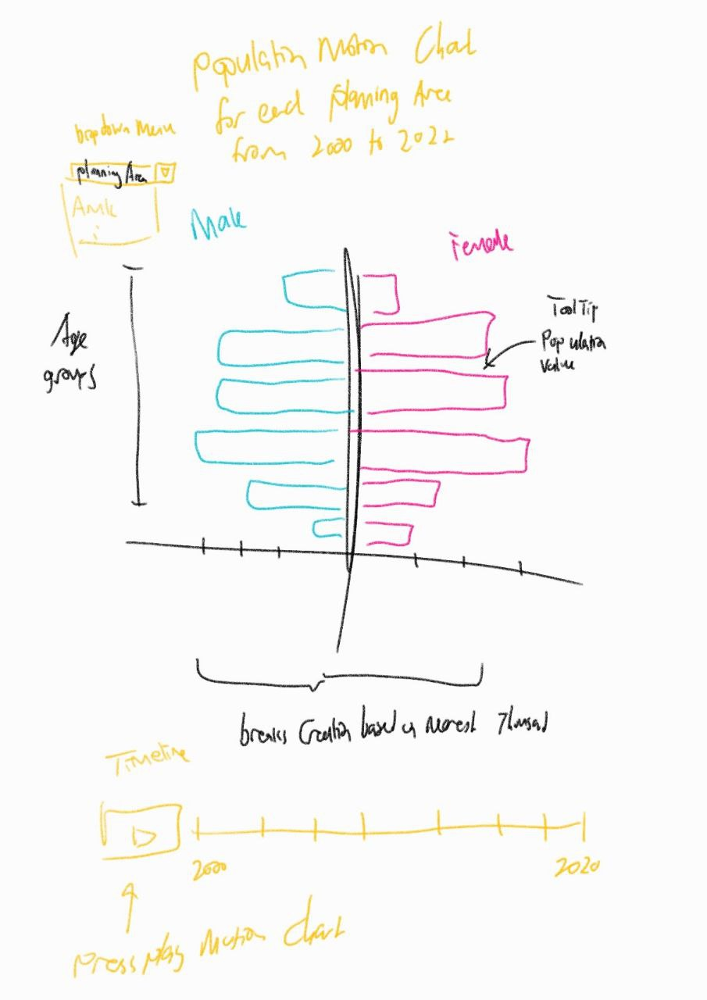
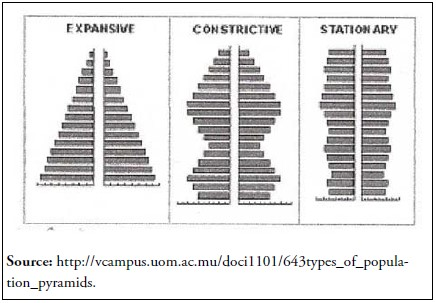

```{r setup, include=FALSE}
knitr::opts_chunk$set(echo = FALSE)
```


# 1 Introduction

## 1.1 Overview 

This case study aims to portray the age-sex structural trend that shifts from 2000 to 2020 for the population of Singapore. Different from [Take Home Exercise 1](https://isss608cosq.netlify.app/th_ex/th_ex01/th_ex01), we will learn how to convert the population pyramid static chart created using [ggplot2](https://ggplot2.tidyverse.org) into an interactive one; using interactive charting packages for R.

More details pertaining to the data and graphs will be explained in later sections.

# 2 Case Study : Singapore Population trend 

The aim of this case study explores the creation of a population pyramid representing Singapore population data collected on the month of June from year 2000 to 2020, using R. 

## 2.1 Overview and Dataset 

The [Singapore Residents by Planning Area/Subzone,AgeGroup.Sex and Type of Dwelling Singstat Dataset](https://www.singstat.gov.sg/find-data/search-by-theme/population/geographic-distribution/latest-data) representing the number of people staying in different regions of Singapore by age cohort, sex and dwelling details. This time, we will be making use of two data sets from the same [source](https://www.singstat.gov.sg/find-data/search-by-theme/population/geographic-distribution/latest-data) that would need to be combined later in order to represent the complete population data set for our case study. 

These are namely: 

1.**Singapore Residents by Planning Area / Subzone, Age Group, Sex and Type of Dwelling, June 2000-2010**

2. **Singapore Residents by Planning Area / Subzone, Age Group, Sex and Type of Dwelling, June 2011-2020**

Notice that these data sets are in separate data frames and there is a need to do some data wrangling to prepare the data for visualization. However, before dwelling into that, we will explore some ideas and inspiration from in-class exercise and previous take home exercise to understand how to create the charts better but first let's understand the task. 


### The Task
Build an interactive age-sex pyramid representing the demographic structure of Singapore by age cohort and gender that show the trends of the age-sex structure of Singapore population from 2000 to 2020 at **planning area level**

### Understanding the Task

The Population pyramid is used to present the distribution of different age cohort representing a particular population. It is well known for its pyramid looking shape. Typically it shows a continuous stacked horizontal histogram bar. The population size is on the x-axis while the age-cohort would be presented on the y-axis. The height of each bar typically represents either an absolute frequency or a percentage of the number of people in each age cohort. 

Through the population pyramid, we can understand age-sex structure of the Singapore population and identify the population pyramid trend which can unveal things about fertility and motility and whether it is a shrinking population.

#### **Why Interactive ?** 

Instead of presenting graphs in a fixed frame, we can create interactive charts.

Interactive charts have become a popular way to allow users to explore the visualize and interact with chart elements to get a better sense/context of the graphical message. The good thing about using dash boarding platforms like tableau, is its ability to provide customization interactive capabilities with a few clicks away. This often contain animations and interactive element customization to provide a unique chart exploration experience. 

Notice that in R, this capability is not automatically applied to visuals created using the ggplot2 library. Instead, we can utilize interactive plotting elements from other libraries to create these interactive elements. 

#### How does it work? 

We need to understand how interactive charts would work in R. There are two known approaches to create interactive charts:

1. Building a `ggplot geometric objects` and utilize interactive packages to add on the capabilities interactivity 
2. Building using the interactive package itself like `plotly`


Before we begin to select the method, we will sketch out the graph that we are going to make.

---

## 2.2 Proposed Sketch and Inspiration 
These sketches were inspired by interactive capabilities learnt from in class exercise 3 on tableau.

### Population Pyramid 

A population pyramid shows the distribution of a population by age group and sex. The term pyramid is used to depict a growing population, which most countries hope to achieve. In the context of Singapore, this population pyramid will depict Singapore's population distribution and the colors, blue and pink will be used the males and females respectively. Since in this task, we are to provide the pyramid for all planning areas, we will create the drop down menu for users to select the planning area they want to view and a play button to allow users to view the population trend over the years from 2000 to 2020.

### The Inspiration and Changes

#

Notice from the sketch that...

# 3 Required Libraries
This section provides a summary of the packages required for this exercise. 

* [**tidyverse**](https://www.tidyverse.org) : A collection of core pakages designed for data science in R 

* [**plotly**](https://plotly.com/r/getting-started/) : Package used to creating interactive web-based graphs via the open source JavaScript graphing library plotly. js 

* [**ggiraph**](https://davidgohel.github.io/ggiraph/) : Package used to create dynamic ggplot graphs. This allows you to add tooltips, hover effects and JavaScript actions to the graphics.

* [**patchwork**](https://patchwork.data-imaginist.com) : Package used to combine separate ggplots into the same graphic

* [**gganimate**](https://gganimate.com) : Package used to include the description of animations 

* [**gifski**](https://cran.r-project.org/web/packages/gifski/index.html) : Package used to convert images to gifs

* [**knitr**](https://cran.r-project.org/web/packages/knitr/index.html) : Package used for dynamic report generation

* [**kableExtra**](https://cran.r-project.org/web/packages/kableExtra/vignettes/awesome_table_in_html.html) : Package used for table generation and simple table output designs

The following code chunk will check if the required libraries are installed first before loading them into the R environment.

```{r message=FALSE, warning=FALSE, echo=TRUE}
packages = c('ggiraph', 'plotly', 
             'DT', 'patchwork',
             'gganimate', 'tidyverse',
             'readxl', 'gifski', 'kableExtra', 'knitr')
for (p in packages){
  if(!require(p,character.only = T)){
    install.packages(p)
  }
  library(p, character.only = T)
}
```

---

# 4 Dataset Challenges

---
The following are the data challenges faced:

1. Notice that the data representing the population trend from 2000 to 2020 are in separate files. As such, there will be a need to combine these data. We also need to verify that the union of the files if successful

2. We need to check for abnormal data fields and missing values and exclude them from the data set. We also need to remember to factorize the age group column as we did in take home exercise 1 using `facotr()`

3.Notice that this time, there is a need to be aware of the multiple columns and groups we need to `group_by()` later on using `dyplr` package and other data preparation methods to prepare the data

4.Knowing that we have a way to already create a `ggplot` population pyramid, we need to now think of the geometric customization of the interactive libraries to produce the same graph but with more intuitive feature for interaction and understanding.

## 4.1 Data Prepation 

The data set is of '.csv' extension which equates to comma separated field format. As such, the `read_csv` function using the **readr** library can be used as seen below.  

```{r echo = TRUE, message=FALSE, warning=FALSE}

#Reading the Data
pop_2010  <- read_csv('./data/respopagesextod2000to2010.csv')
pop_2020 <- read_csv('./data/respopagesextod2011to2020.csv')

dis1 <- head(pop_2010)
dis2 <- head(pop_2020)

```

Here are have **Singapore Residents by Planning Area / Subzone, Age Group, Sex and Type of Dwelling, June 2000-2010**

```{r echo = FALSE, message=FALSE, warning=FALSE}
knitr::kable(dis1)
```

and here we have **Singapore Residents by Planning Area / Subzone, Age Group, Sex and Type of Dwelling, June 2011-2020**

```{r echo = FALSE, message=FALSE, warning=FALSE}
knitr::kable(dis2)
```

Next, we will need to check for missing values and remove them if any. The code below checks for missing values. Notice that both data set do not have missing values. 

```{r echo = TRUE, message=FALSE, warning=FALSE}
# check for missing values, rows with more 70% missing
print(pop_2010[rowSums(is.na(pop_2010)) >= 0.7,])
print(pop_2020[rowSums(is.na(pop_2020)) >= 0.7,])
```

Now we will need to check the columns to ensure that both tables contain the same number of columns before we union them together. The code chunk below shows the name of the columns of the two data frames. It seems that they contain the same number of columns and so we will combine them.

```{r echo = TRUE, message=FALSE, warning=FALSE}
# checking the columns before a union 
print(names(pop_2010))
print(names(pop_2020))
# all same + the data type is same 
```

Combining the columns using the `union()` operation by `dplyr` will allow us to merge the datasets one under another, merge to the bottom. Following the printed tables, on the top, we have the table where it shows to be from 2000 and the bottom the table where it shows to be 2020. 

```{r echo = TRUE, message=FALSE, warning=FALSE}
# union these data set 
combined_pop <- union(pop_2010, pop_2020)
```

```{r echo = FALSE, message=FALSE, warning=FALSE}
kable(head(combined_pop))
```

```{r echo = FALSE, message=FALSE, warning=FALSE}
kable(tail(combined_pop))
```


## 4.2 Data Checking 

To ensure that data have successfully merge, lets ensure that the rows combined are the same.

```{r echo = TRUE, message=FALSE, warning=FALSE}
# checking the number of rows 
print(nrow(pop_2010) + nrow(pop_2020)) 
print(nrow(combined_pop))
# Turned out same
```

After successfully merging the data sets, lets check if the values of the categorical column and ensure that they are consistent to ensure data quality. The code chunk below would do the former. 

```{r echo = TRUE, message=FALSE, warning=FALSE}
# checking combined data for missing values
print(unique(combined_pop$PA)) # Not stated is found, exclude using dyplr mutate
print(unique(combined_pop$AG)) 
print(unique(combined_pop$Sex))
```

From the above, it seems like `*Not Stated*` value of the `PA` (Planning Area) Column show to be rows that can affect the data quality of the visualization and analysis. *As such, during the data wrangling stage, we will exclude rows with this value*

**Also** notice that there are many planning areas. We will go ahead and perform another data quality check to ensure that all areas have population values.

1. We will `select()` all planning locations
2. `group_by()` planning locations and `summarised()` sum their total population values
3. `filter()` for all sums that are 0
4. `select()` only the planning area and finally `ungroup()` 
5. print the list of locations with no population values as a vector

```{r echo = TRUE, message=FALSE, warning=FALSE}

Location_pop <- combined_pop %>%
  select(PA, Pop) %>%
  group_by(PA) %>%
  summarise(total=sum(Pop)) %>%
  filter(total==0) %>%
  select(PA) %>%
  ungroup()

kable(Location_pop)
```

```{r echo = TRUE, message=FALSE, warning=FALSE}

no_pop_locations <- as.vector(Location_pop$PA)
print(no_pop_locations)

```
These locations will be filtered out in data wrangling. Removing these locations will also help with the interactie chart render time.


## 4.3 Data Wrangling 

Upon successfully checking the quality and preparing the raw data to be wrangled, we will proceed with the data wrangling process. The following code chunk will do the following : 

1. `select()`     : Planning Area, Time, Age group, gender and population columns 
2. `group_by()`   : Planning Area, Time, Age group and gender to sum up the population for the respective categories 
3. `summarise()`  : Summaries these respective groups with the total population   
4. `arrange()`    : Sort the output data frame according to Planning Area, Time, Age group and then gender
5. `filter()`     : Filter out the `*Not Stated*` value of the `PA` (Planning Area) Column as mentioned in the previous section.  `*%in%*` is the same as `*in*` operator used to check if a column contains a value from a list/vector of string values. `!` operator in this case would do the opposite
6. `ungroup()`    : It is good practice to un-grouping your data after every `group_by()` function
7. Renaming       : We will go ahead and rename the columns to be more readable

```{r echo = TRUE, message=FALSE, warning=FALSE}

# GET DATA
combined_pop_grouped <- combined_pop %>% 
  select(PA,Time,AG, Sex, Pop) %>%
  group_by(PA,Time,AG,Sex) %>% 
  summarise(Total = sum(Pop)) %>%
  arrange(PA,Time,Sex,AG) %>%
  filter(PA != 'Not Stated') %>%
  filter(!PA %in% no_pop_locations) %>%
  ungroup()

# renaming table columns
names(combined_pop_grouped) <- c("Planning_Area","Year","Age_Group","Gender","Population")
```

Quick check 

```{r echo = TRUE, message=FALSE, warning=FALSE}
print(unique(combined_pop_grouped$Planning_Area))
```

Next, the total Population size of males for each group will be multiplied by a factor of -1 to vertically flip the values from the positive x-axis to the negative x-axis.

```{r echo = TRUE, message=FALSE, warning=FALSE}

# All males are negative so they go to the left
combined_pop_grouped$Total_Population <- combined_pop_grouped$Population
combined_pop_grouped$Total_Population <- ifelse(combined_pop_grouped$Gender == "Males"
                                                , -1*combined_pop_grouped$Total_Population
                                                , combined_pop_grouped$Total_Population)
```

```{r echo = FALSE, message=FALSE, warning=FALSE}
head_female <-head(combined_pop_grouped)
head_male <- tail(combined_pop_grouped)
knitr::kable(head_male)

```


```{r echo = FALSE, message=FALSE, warning=FALSE}
knitr::kable(head_female)
```

On the bottom, notice female values for total_population is positive while male is negative (top table) this will be used for the `barplot` element.

Interactive Charts also often make use of tool tips. As such, we will set up the text that we want to display to users. One thing we need to clean is the `*Age Group*` column. Notice that there are `_` (underscores) that act as spaces between the characters.

```{r}
kable(combined_pop_grouped$Age_Group[1:5])
```
To resolve this, the following code chunk will show how we utilize the `sub()` function to substitute the `_` and create a tool tip column that shows the `Gender`,`Age Group` and `Population`. It will utilize the `\n` special character to signal for a new line between these fields in the tool tip. Once we have replace the characters, we will factorize the `Age Group` column; respective age bins (categories) in an ordered manner, with those of ages 0 being the smallest and over 90 being the largest value in the scale.


```{r}
# Tool-Tip

# Substituting '_'
combined_pop_grouped$Age_Group<-sub('_to_', ' to ', combined_pop_grouped$Age_Group)
combined_pop_grouped$Age_Group<-sub('_and_', ' and ', combined_pop_grouped$Age_Group)

# Creation of the tooltip 
combined_pop_grouped$tooltips <- c(paste0("Gender = ", combined_pop_grouped$Gender
                                          , "\n Age Group = ", combined_pop_grouped$Age_Group
                                          , "\n Population = ", combined_pop_grouped$Population ))

# Similarly, like take home excersize one, we will factorize the age group
combined_pop_grouped$Age_Group <- factor(combined_pop_grouped$Age_Group, ordered=TRUE ,levels=c("0 to 4","5 to 9","10 to 14","15 to 19","20 to 24","25 to 29","30 to 34","35 to 39","40 to 44","45 to 49","50 to 54","55 to 59","60 to 64","65 to 69","70 to 74","75 to 79","80 to 84","85 to 89","90 and over"))


```


# 5 Building the Visalisation 

## 5.1 Customizing and Building the Population Pyramid Chart

To build the Population Pyramid chart there are a few components and geometric objects we need to be familiar with. The core components come from the `plotly` and `ggplot` library. It's uses in this segment is explained as follows:

* `plot_ly()` : 

* `add()`: 
    
* `layout()` : 

* `themes()` : 

```{r echo = TRUE, message=FALSE, warning=FALSE,  fig.width=7, fig.height=6}

```

# 6 Conclusion and Interpretation

Population pyramids are important graphical representation to understand the composition of population members.It is typically visualized by grouping the population members into age cohorts and further diving the data points into their respective gender groups. In other words, the age-sex structure of specific populations. This makes it easy for demographers to compare the difference between male and female populations and the structure of the population at any given moment. Demographers typically use this to study the trend of populations relating to the fertility and mortality.

There are three trends in  population pyramids they are typically:
- expansive
- constrictive
- stationary 

#

We shall focus our efforts in explaining the trend that is reflected in our plot. 

### Chart interpretation and conclusion 

The Singapore population trend across all regions for both gender is depicted to follow a constrictive population pyramid trend with its 'beehive' shape.

- It has a shape with a wide area in the middle covering the middle age group (15 to 64). 
- It has a narrow base with the younger age cohort (typically below 15) 
- It has a narrow tip with the elderly age group (typically over age of 64)

Age structure division adapted from [here](https://ourworldindata.org/age-structure)

As observed in our population pyramid, there is observed to be lower mortality and fertility rate. This translate to lower birth rates (lesser in the younger cohort) and death rates (lesser in the elderly age cohorts). Population members mostly reside in the middle age group.With the most falling in the 55-59 age range.

Overall, the population pyramid with a constrictive trend represents a population that is shrinking. With a constant fertility rate and a large middle age group which would grow old eventually, will result in a shrinking population.

[Research](http://wwjmrd.com/upload/types-and-significance-of-population-pyramids_1523552342.pdf) have shown that constrictive population pyramids are typical of countries with higher socio-economic development who have access to higher quality education and accessible healthcare available to a large proportion of the population. Thus, it is no surprise that countries like : Japan, Germany and Italy have a similar age-sex structure as Singapore 

# 6.1 Tableau vs R

This take home exercise was heavily inspired by an in-class exercise which uses Tableau to visualize a similar data set with the same aims. Tableau is a drag and drop visualization tool with highly interactive features and graphs. On the other hand, R is a programming language used for Data Analytics and other scientific fields. The differences between these two platforms poses a challenge to this exercise as there were steps required by R that were not needed by Tableau and vice versa. In this section, the key differences experiences when visualizing the same data set with the same type of graph will be explained. 

1. *Animation Capabilities* : Tableau provides a lot of animation capabilities in a click. This includes most of the animation aesthetics like customizing the tooltip to include sub charts and the creation of the motion chart done during the in class exercise. The animation, interval and pages are easily incorporated in tableau. One of the hardest thing to create was to tweet the animation settings in R as there is a need to reference the `ggiraph` library 

2. *Customization Capabilities* : While Tableau is easy to configure to the desired chart, certain customization abilities is only possible through R. For example, the use of functions to automatically adjust the ticks to detailed levels

3. "*Smoothest*" : In Tableau, running interactive charts seem to be smoother and much more responsive. This capability is fallen short in R. The charts seem to have a noticeable lag and producing highly customized charts have shown to slow down R studio a lot. This makes it had to test highly customized charts 

Overall, Tableau provides as quick way to do up an already interactive chart. R, on the other hand, provides a lot of customization capabilities and flexibility. The two software have their own peaks at producing interactive charts, however, it would depend on the level of customization needed. Tableau is quick to market while R is highly flexible.


