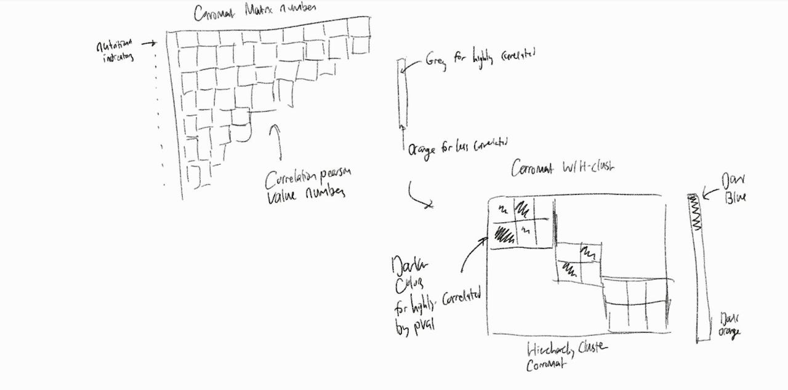
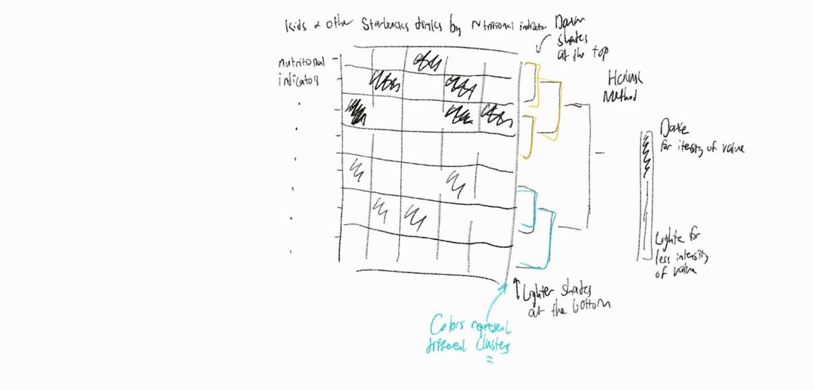
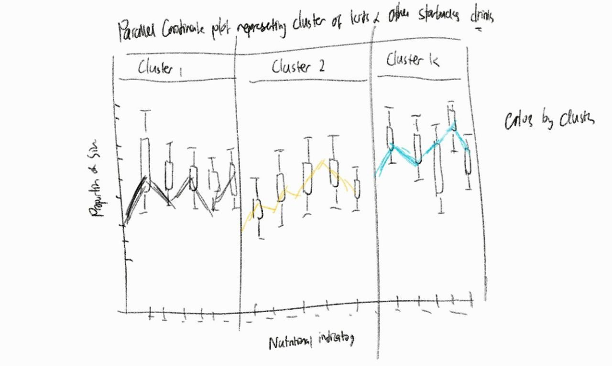
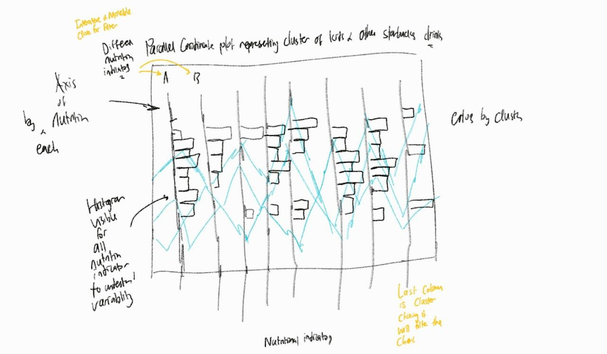

```{r setup, include=FALSE}
knitr::opts_chunk$set(echo = FALSE)
```


# 1 Introduction

## 1.1 Overview 

This case study aims to study the nutritional indicators of a "Kids Drink and Others" provided by Starbucks. This markdown file will conduct an analysis to understand the segments of the different kinds of Starbucks drinks. Segmentation analysis is often used to understand distinctive features of a cluster of objects of interest. These different categories of groups can be further analyzed in terms of their characteristics once we segment them.

More details pertaining to the data and graphs will be explained in later sections.

## 1.2 Overview and Dataset 

### The Task
Creation of a data visualization that segments "kid drinks and other" by nutrition indicators seen in the [Starbucks Drink dataset](https://www.kaggle.com/starbucks/starbucks-menu). 

### Understanding the Task

In this task, we will need to understand the basis of segmentation analysis. We will need to understand the kinds of visuals that will provide graphical representation of segment features. With proper visual elements, these charts should provide users a way to compare between groups. Charts should also allow users to observe patterns and the distribution of characteristics. We explore charts inspired by [Lesson 4: Fundermentals of Visual Analytics](https://isss608-ay2021-22t2.netlify.app/outline/lesson04_outline)

## 1.3 Sketching up the Visuals 

### Correlogram Sketch 

```{r echo=FALSE, fig.cap = "Correlogram Sketch Up"}

```

In the upper top left of the image, we will be making a correlogram filled with the "number" option to first understand their relational value with the pearson correlation value. We can then better understand the relation between these variables using a hierachical clustering method visalised on to the correlogram highlighting variables of similar behaviour in bordered boxes.

### HeatMap Sketch

```{r echo=FALSE, fig.cap = "HeatMap Sketch Up"}

```

The heat map would represent the more unhealthy drinks at the top as we can order them according to the values output by hierachical clustering methods. We can then use the color coding of more intense colors to represent higher values in a particular nutritional indicator. We can also add the dendrogram view which will provide the hierachical clustering view at each stage of 'k' cluster. We then can better understand sub clusterings and the inter-relationship between these clusters. In which we can use colors to highlight them as we specify the number of clusters.

### Parrallel Coordinate Plot Sketch 

```{r echo=FALSE, fig.cap = "Parrallel Coordinate Sketch Up"}

```

A parrallel plot with box plot facet by the cluster types can be used to show the attribute values interally for each cluster. We can further improve this by understanding the variability of each nutrion indicator by combining them into one chart as seen below. In which, we can add interactive elements like filter to highlight the different clusters we have build.

```{r echo=FALSE, fig.cap = "Parrallel Coordinate Sketch Up"}

```

---

# 2 Required Libraries

---

This section provides a summary of the packages required for this exercise. 

* [**tidyverse**](https://www.tidyverse.org) : A collection of core packages designed for data science in R

* [**plotly**](https://plotly.com/r/getting-started/) : Package used to creating interactive web-based graphs via the open source JavaScript graphing library plotly. js 

* [**patchwork**](https://patchwork.data-imaginist.com) : Package used to combine separate ggplots into the same graphic.

* [**GGpally**](https://www.rdocumentation.org/packages/GGally/versions/1.5.0) : Package extends to `ggplot2` by adding several functions to reduce the complexity of combining geoms with transformed data.

* [**parcoords**](https://www.rdocumentation.org/packages/GGally/versions/1.5.0/topics/ggparcoord) : Package used to plot static parallel coordinate plots by extending to the `ggplot` package.

* [**parallelPlot**](https://cran.r-project.org/web/packages/parallelPlot/parallelPlot.pdf) : Package extends to D3.js plots for creating interactive parallel coordinate plot.

* [**broom**](https://cran.r-project.org/web/packages/broom/vignettes/broom.html) : Package was designed to take format that is not in a tabular data format (sometimes not anywhere close) and convert it to a tidy tibble.

* [**ggstatsplot**](https://www.rdocumentation.org/packages/ggstatsplot/versions/0.1.4) : Package is an extension of `ggplot2` package for creating graphics with details from statistical tests included in the plots themselves.

* [**ggside**](https://cran.r-project.org/web/packages/ggside/vignettes/ggside_basic_usage.html) : Package designed to enable users to add metadata to their `ggplots` with ease.

* [**knitr**](https://cran.r-project.org/web/packages/knitr/index.html) : Package used for dynamic report generation

* [**kableExtra**](https://cran.r-project.org/web/packages/kableExtra/vignettes/awesome_table_in_html.html) : Package used for table generation and simple table output designs.

* [**corrplot**](https://cran.r-project.org/web/packages/corrplot/vignettes/corrplot-intro.html):
Package provides a visual exploratory tool on correlation matrix that supports automatic variable reordering to help detect hidden patterns among variables.

* [**dendextend**](https://cran.r-project.org/web/packages/dendextend/vignettes/dendextend.html): Package provides a set of functions for extending dendrogram objects in R, letting you visualize and compare trees of hierarchical clustering.

* [**heatmaply**](https://cran.r-project.org/package=heatmaply/vignettes/heatmaply.html):heatmaply is a package that interface based around the plotly R package. This interface can be used by choosing plot_method = "plotly" instead of the default plot_method = "ggplot". This interface can provide smaller objects and faster rendering to disk in many cases and provides otherwise almost identical features.

* [**seriation**](https://cran.r-project.org/web/packages/seriation/index.html): Infrastructure for ordering objects with an implementation of several seriation methods to reorder matrices and dendrogram

```{r message=FALSE, warning=FALSE, echo=TRUE}

packages = c('plotly', 
             'DT',  'tidyverse',
             'readxl', 'kableExtra', 'knitr', 'GGally', 'parcoords', 'parallelPlot', 'dplyr', 'broom', 'ggstatsplot', 'ggdist', 'ggside', 'corrplot', 
             "factoextra", "dendextend","heatmaply","seriation")

for (p in packages){
  if(!require(p,character.only = T)){
    install.packages(p)
  }
  library(p, character.only = T)
}

```

---

# 3 Dataset Challenges and Preparation

---

The following are the data challenges faced:

1. While there are a number of different types of drinks available, each drink type has further options like milk or no milk and whip cream and no whip cream.Furthermore, the milk category can be further categorized into many different milk types like "Almond", "2% milk" and so fourth.. We will need to find a way to identify these different types of drinks as they contribute to the calories as a whole. 

2. Notice also that there are also missing values in the data set. For example, in the column of milk, customers who do not want milk would have their row value left blank. We will need to further investigate for missing values once we filter the data to ensure data quality. 

3. Notice also that there are duplicated rows in the data set in which we need to remove as they would be affecting the clustering algorithms and run time. It is also good practice to remove duplicated rows so as to not introduce unnecessary bias. 

## 3.1 Reading the Data 

The data set is of '.csv' extension which equates to comma separated field format. As such, the `read_csv` function using the **readr** library can be used as seen below.  

```{r echo = TRUE, message=FALSE, warning=FALSE}
#Reading the Data
starbucks.data <- read.csv('./data/starbucks_drink.csv', header = TRUE)

DT::datatable(
      head(starbucks.data),
      options = list(scrollX = TRUE)
    )

```

## 3.2 Filtering the Dataset

Since we are only interested in the "Kids Drink and Others" category, we will go ahead and filter for that subset of data. To do so, we will be using `dplyr` `filter()` function which as explained in other take home exercise, a function used to filter out the data. 

```{r echo = TRUE, message=FALSE, warning=FALSE, fig.width=6}
# Filtering for a category
starbucks.kids_and_other <- starbucks.data %>% 
  filter(Category == "kids-drinks-and-other")

DT::datatable(
      starbucks.kids_and_other,
      options = list(scrollX = TRUE)
    )
```

## 3.3 Data Issue 1: Checking for missing values 

When we first view the original dataset `starbucks.data`, we realize that there is missing values present in some of its columns. We can investigate this using the code chunk seen below which presents a way to count the number of missing values present in each column. The code chunk works by using `colSums()` function on the data table to count the number of TRUE (TRUE ->1 and FALSE -> 0) using the `is.na()` function. From there, we can create a vector with comparison operator `>` and check for columns where missing values are more than 0. 

```{r echo = TRUE, message=FALSE, warning=FALSE}
colSums(is.na(starbucks.kids_and_other)) > 0 
```

Notice that all columns produce results to be false. However, that is not true, missing values can exist in many forms but for this case, is can exist as a blank `""` (an empty string). Such missing values often arise in cases of self recorded data or surveys usually caused by technical faults in data collection or human error in data entry. 

In this case, we will need to modify this code chunk to the following : 

```{r echo = TRUE, message=FALSE, warning=FALSE}
colSums(starbucks.kids_and_other == "") > 0
```

Notice on the filtered data set as seen in the code chunk above; there is missing values;Thus, we will need to handle these missing data. To do so, lets understand the context of the missing data.  

```{r echo = TRUE, message=FALSE, warning=FALSE}
starbucks.missingname <- starbucks.kids_and_other %>% 
  filter(Milk == "") %>%
  select(Name)
kable(starbucks.missingname)
```

Notice that the drink that does not have both `Milk` and `Whipped.Cream` column filled in is related to the `Steamed Apple Juice`.It is found that there is no option for `Milk` and `Whipped.Cream` for this drink. As such, we can replace these values with "No Milk" and "No Whipped Cream" respectively. The code chunk below would make use of the `sub()` function to replace all empty strings with their respective values.

```{r echo = TRUE, message=FALSE, warning=FALSE}
starbucks.kids_and_other$Milk[starbucks.kids_and_other$Milk == ""]<- sub(""
, "No Milk", 
starbucks.kids_and_other$Milk[starbucks.kids_and_other$Milk == ""] )

starbucks.kids_and_other$Whipped.Cream[starbucks.kids_and_other$Whipped.Cream == ""]<- 
  sub("","No Whipped Cream"
      ,starbucks.kids_and_other$Whipped.Cream[starbucks.kids_and_other$Whipped.Cream == ""] )

```

Check again if there are no more columns with empty string.

```{r echo = TRUE, message=FALSE, warning=FALSE}
colSums(starbucks.kids_and_other == "") > 0
```

Now, can conclude that the the "Kids Drinks and Others" subset of data is rid of missing values.

## 3.4 Data Issue 2: Handling the categorical values

There are a few categorical variables in the data set. These are namely Name, Milk Whipped.Cream and Size. Notice that for a combination of these values in a row, it would represent a particular combination to create a certain drink. The code chunk below will generate the table with only the categorical variables of the data set. Notice that for example customers buying the "Cinnamon Dolce Crème" drink can have it with "Almond Milk" with or without "Whipped Cream". Customers can also choose from 5 different sizes. 

```{r, echo=FALSE, message=FALSE, warning=FALSE}
DT::datatable(
      starbucks.kids_and_other %>% select(Name, Milk, Whipped.Cream, Size),
      options = list(scrollX = TRUE)
    )
```

The five different sizes.

```{r, echo=FALSE, message=FALSE, warning=FALSE}
# Sizes to choose from 
print(unique(starbucks.kids_and_other$Size))
```

The problem with this is that some of these features can make the segmentation obvious. For example, a "Hot Chocolate with whipped cream" will have more calories than " Hot Chocolate without whipped cream". Similarly if a drink is bigger, it is bound to have more calories than small sizes assuming we keep every other category the same. 

To solve this problem: 

1. We will remove the unwanted columns we do not need

```{r, echo=FALSE, message=FALSE, warning=FALSE}
# First we will remove un wanted columns to form a new dataframe
starbucks.kids_and_other.processed <- subset(starbucks.kids_and_other, select = -c(Category,Size, Portion.fl.oz.) ) #  Whipped.Cream, Milk,
```

2. We will then combine the "Name", "Milk" and "Whipped Cream" column into one column that would present the name of the drink; in which a single data point. After which, we will need to the normalize the values of each nutritional indicator in proportion to its size. This is to get the ratio of each nutritional indicator for that drink due to that combination. we can uniquely form the full drink name `Full.Name` from this combination to represent a unique data point using the `paste()` function which concats strings into one. 

```{r, echo=FALSE, message=FALSE, warning=FALSE}

# full name of drink 
starbucks.kids_and_other.processed$Full.Name = paste(starbucks.kids_and_other$Name,starbucks.kids_and_other$Milk, starbucks.kids_and_other$Whipped.Cream, sep=" ", collapse=NULL)

DT::datatable(
      head(starbucks.kids_and_other.processed),
      options = list(scrollX = TRUE)
    )
```

3.  Now we will get the ration between the nutritional indicator value to that of the portion of each nutrition indicator that make up the drink. The logic is that since size and proportion relates to the same meaning, with all the volume being consistent based on size, we don't need the size column.

```{r, echo=FALSE, message=FALSE, warning=FALSE}
starbucks.kids_and_other.processed$Calories <- starbucks.kids_and_other$Calories/starbucks.kids_and_other$Portion.fl.oz.
starbucks.kids_and_other.processed$Calories.from.fat <- starbucks.kids_and_other$Calories.from.fat/starbucks.kids_and_other$Portion.fl.oz.
starbucks.kids_and_other.processed$Total.Fat.g. <- starbucks.kids_and_other$Total.Fat.g./starbucks.kids_and_other$Portion.fl.oz.
starbucks.kids_and_other.processed$Saturated.fat.g. <- starbucks.kids_and_other$Saturated.fat.g./starbucks.kids_and_other$Portion.fl.oz.
starbucks.kids_and_other.processed$Cholesterol.mg. <- starbucks.kids_and_other$Cholesterol.mg./starbucks.kids_and_other$Portion.fl.oz.
starbucks.kids_and_other.processed$Sodium.mg. <- starbucks.kids_and_other$Sodium.mg./starbucks.kids_and_other$Portion.fl.oz.
starbucks.kids_and_other.processed$Total.Carbohydrate.g. <- starbucks.kids_and_other$Total.Carbohydrate.g./starbucks.kids_and_other$Portion.fl.oz.
starbucks.kids_and_other.processed$Dietary.Fiber.g. <- starbucks.kids_and_other$Dietary.Fiber.g./starbucks.kids_and_other$Portion.fl.oz.
starbucks.kids_and_other.processed$Sugars.g. <- starbucks.kids_and_other$Sugars.g./starbucks.kids_and_other$Portion.fl.oz.
starbucks.kids_and_other.processed$Protein.g. <- starbucks.kids_and_other$Protein.g./starbucks.kids_and_other$Portion.fl.oz.
starbucks.kids_and_other.processed$Caffeine.mg. <- strtoi(starbucks.kids_and_other$Caffeine.mg.)/starbucks.kids_and_other$Portion.fl.oz.

DT::datatable(
      head(starbucks.kids_and_other.processed),
      options = list(scrollX = TRUE)
    )

```


## 3.5 Data Issue 3: Checking for Duplicated Rows

There seems to be duplicated rows present. We will `sum()` the `duplicated()` rows of the data frame.

```{r echo=TRUE, message=FALSE, warning=FALSE}
sum(duplicated(starbucks.kids_and_other.processed))
```

We will then proceed to filter the data frame by selected rows that are not (`!`) duplicated.

```{r echo=TRUE, message=FALSE, warning=FALSE}
starbucks.kids_and_other.processed <- 
starbucks.kids_and_other.processed [!duplicated(starbucks.kids_and_other.processed), ]
```


## 3.6 Data Issue 3: Multicollinearity Issue using Correlation Matrix

The next stage of the analytically process is to check for multi-colinearity issues. The problem with multi-colinearity is that it can affect the model performance as it generates high variance of estimated coefficients. Hence, the estimated coefficients of variables will not be accurate of the full picture. To understand which columns to remove, we will use a correlation matrix build graphically with `ggcorrmat()` using the `ggstatsplot` package to understand the correlation between variables. 

### 3.6.1 Buidling a Correlogram

```{r echo=TRUE, message=FALSE,warning=FALSE, fig.width=9, fig.height=9,}

ggstatsplot::ggcorrmat(
  data = starbucks.kids_and_other.processed, 
  cor.vars = 1:11,
  ggcorrplot.args = list(outline.color = "black",
                         hc.order = TRUE,
                         tl.cex = 10),
  ggplot.component = list(
    theme(text=element_text(size=5.5),
      axis.text.x = element_text(size = 7),
      axis.text.y = element_text(size = 7),
      axis.title = element_text(size=9)
      )),
  ggtheme = ggplot2::theme_light(),
  palette = "category10_d3",
  title    = "Correlogram representing the Nutritional Indicators of Starbucks Drinks",
  subtitle = ""
  
) +
  ggplot2::theme(
    axis.text.x = ggplot2::element_text(
      margin = ggplot2::margin(t = 0.15, r = 0.15, b = 0.15, l = 0.15, unit = "cm")
    )
  )
```

We can compliment this with a correlation matrix plot that utilizes a clustering method to help better group features together.To build this plot:

1. We will use the `corrplot()` function that also ultilize the hierartical clustering methods under `hclust.method` argument. With this, we will use the `ward.D` `ordering` method as of now, but later will show how we evaluate which is the best distance criterion to use. The highlight of the clusters would be specific in the `addrect` argument specific as 3 for 3 clusters.

2. We will specify the `method` to be square to change the cell shape to square where intensity would mean how much it fill up that cell. 

3. `tl.pos` and `tl.cos` both of which represent positioning and color respectively. The `tl` abbreviation would just mean text label. we will set position to the left with the "lt" value for `tl.pos` and we will set the color of the text labels to "black" for `tl.col`. `tl.offset` is used to see text by offsetting the position.

4. Lastly, we will give it a title using the `mtext()` function which creates a text geom object. In which case, we are able to set the title because using the default `title` argument appears to have an issue with the `corrplot` as the title will run off despite specifying the marigns with the `mar` argument

```{r, echo=TRUE, message=FALSE, warning=FALSE, fig.height=12, fig.width=9}
starbucks.kids_and_other.processed_corr <- cor(starbucks.kids_and_other.processed[,2:10])
corrplot(starbucks.kids_and_other.processed_corr, 
         method = "square",
         tl.pos = "lt",
         tl.col = "black",
         tl.offset = 1,
         order="hclust",
         hclust.method = "ward.D",
         addrect = 3
         ) 
mtext("Corrogram of Nutrition Indicators for Kids and Others Starbucks Drinks", at=5, line=-1.4, cex=1.5)
mtext("Three Clusters of Nutritional Indicators are deemed to be similar", at=3.5, line=-2.5, cex=1.2)

```

### 3.6.2 Interpreting the Correlogram  

From the above chart, notice that only 6 pairs are found to be significant. Apart from which the darker elements is seen to reflect pairs of variables that have high correlational value towards each other. As seen, the follow pairs have a high correlation value above 0.8 these include : 

- (Total Fat, Calories) = 1
- (Total Fat, Saturated Fat) = 0.89
- (Calories From Fat, Saturated Fat) = 0.89
- (Total Carbohydrate, Sugar) = 0.96

From the above pairs, we will remove the following variables to avoid multi collinearity issues. These include : 

- Total Fat 
- Calories From Fat
- Total Carbohydrate

These values in the Correlogram reflect correlation coefficients and we can actually interpret this part apart from it being a tool to for multi-col linearity issues. We can read the correlation between these nutritional indicators to give us a sense of their relationship. The cluster would pertain to the following mix of nutritional variables : 

1. Cluster 1 consist of Cholesterol, Saturated Fat, Calories From Fat and Total Fat
2. Cluster 2 consist of Trans Fat and Protein
3. Cluster 3 consist of Dietary Fiber, Sodium, Calories, Total Carbohydrate and Sugar

Increasing the number of Clusters did not improve the segmentation of the nutritional indicators.

### 3.6.3 Building an alternative to the Correlogram using heatmaply

1. `cor.test.p` is a function that takes in a dataframe and calculates the p.value between two variables as seen in function `FUN`. 

2. To apply `outer()` we will need to ensure that the vectors are factorized first. This function will find the product of 2 arrays to form a new matrix with their dimensions. This will create the newly formed data frame with the newly calculated p-value.

3. We will then assign the column names to both as rownames and column names of the newly created dataframe `z`

4. After creating the dataframe containing the p-value of the nutritional indicators, we can start building the chart using the `heatmaply_cor()` function. This function interface with the `plotly` package that will allow use to build a heatmap in a table form where the numbers are coded in color blocks.  

5. After passing in the dataframe `starbucks.kids_and_other.processed_corr` we will get the log of these values of the dataframe. This is to amplify the point size (`point_size_mat`) of the heat map and we will use the `scatter` option for the `node_type` along with this argument and assign the `point_size_name` to that of the value used for `point_size_mat`

6. We will then do some labeling where we will include the x, y and correlation labels in the tooltips. We will then give the chart a `main` title.


```{r echo=TRUE, ,message=FALSE, warning=FALSE, fig.width=9, fig.height=9}
## We use this function to calculate a matrix of p-values from correlation tests
cor.test.p <- function(x){
    FUN <- function(x, y) cor.test(x, y)[["p.value"]]
    z <- outer(
      colnames(x), 
      colnames(x), 
      Vectorize(function(i,j) FUN(x[,i], x[,j]))
    )
    dimnames(z) <- list(colnames(x), colnames(x))
    z
}
p <- cor.test.p(starbucks.kids_and_other.processed[2:10])

DT::datatable(
      head(p),
      options = list(scrollX = TRUE)
    )
```


```{r echo=TRUE, message=FALSE, warning=FALSE, fig.height=10, fig.width=10}
heatmaply_cor(
  starbucks.kids_and_other.processed_corr,
  node_type = "scatter",
  point_size_mat = -log10(p), 
  point_size_name = "-log10(p-value)",
  label_names = c("x", "y", "Correlation"),
  main = "Kids and Others Starbucks Drink Nutrition Indicator Correlation Matrix ",
  fontsize=9,
  height= 700,
  width= 700
)

```

Pointers on the Chart:

- Notice that from the above correlation matrix, we are able to easily view the relationship that are stronger versus weaker using the size of the point markers. Notice how the log transformation managed to scale the size of the point markers making it more noticeable to the viewers. It also makes use of the red color to show that these are variables that really would require "attention". 

- The ability of heatmaply to provide the hierarchical clustering model allow us to interpret the heat map more. It allow us to better understand the similarity of the relation between nutritional indicators as the number of k clusters increase. This is as oppose to a normal correlation matrix where we can only view the bi-variate relationship. For example, notice that in the previous correlation matrix, we only know that `Total Fat` and `Calories from Fat` are similar but with the assisted view of the hierarchical clustering dendrogram, we know that the next similar nutritional indicator is `Saturated Fat` followed by `Cholestrol` and that essentially is merged with the `Trans Fat` and `Protein` cluster of nutiritonal indicator. Overall, this chat produces the same conclusion of that of the correlation matrix but offers more insight in the relationship between variables. 

- Before we end of this part of the data preparation and exploration process, we will remove the variables of high co-linearity. We will do the removal of such column using the `dyplr::select(-c())` as seen below.

```{r, echo=TRUE, message=FALSE, warning=FALSE}
starbucks.kids_and_other.processed <- starbucks.kids_and_other.processed %>% 
  select(-c(Total.Fat.g., Calories.from.fat, Total.Carbohydrate.g.))
```


---

# 4 Building the Visalisation 

---

## 4.1 Heat Map

Heat maps are graphical representation that utilize a color coded system. The purpose of heat maps is to visualize the volume of events / attributes within a data set for object of interest. It will assist users judgement as the colors will help them to direct their views towards the part of the visualization that matters the most; which is why we can say that heat maps are visuals that rely a lot on colors to communicate values. This is especially so when dealing with large data sets as colors can make it easier to distinguish and makes sense of the raw numbers. In this case, we will attempt to use a heatmap to color map the nutiritional indicators of the starbucks drinks to show areas where they have higher volumes/density of a particular nutrition.

### 4.1.1 Data Preparation

To create heat map in R, we need to first replace the rows of our data set to contain the ID ( name of the object of interest) in which we want to cluster. For this data set, it will be the full name of the drink which we created during data cleaning. This will allow us to represent each drink as a data point on its own in which we can use it for hierarchical ordering in later steps. 

The code chunk below will make use of the `aggregate()` function to first group all drinks and get their means. In this case, since all drinks already represent a unique data point, it will just be their nutritional indicator value respetively. The `rows.names()` function will then rename the data frame where their row names will represent the drinks names.

```{r, echo=TRUE, message=FALSE, warning=FALSE}
starbucks.kids_and_other.processed.grouped <- aggregate(starbucks.kids_and_other.processed[, 2:10]
,list(starbucks.kids_and_other.processed$Full.Name), mean)
row.names(starbucks.kids_and_other.processed.grouped) <- starbucks.kids_and_other.processed.grouped$Group.1

DT::datatable(
      head(starbucks.kids_and_other.processed.grouped),
      options = list(scrollX = TRUE)
    )
```

To complete the data processing stage, we will select the numerical columns and retrieve the matrix format of the data: **starbucks.matrix**

```{r, echo=TRUE, message=FALSE, warning=FALSE}
starbucks.kids_and_other.processed_m <- dplyr::select(starbucks.kids_and_other.processed.grouped, c( 2:10))
starbucks.matrix <- data.matrix(starbucks.kids_and_other.processed_m)

DT::datatable(
      head(starbucks.matrix),
      options = list(scrollX = TRUE)
    )
```

### 4.1.2 Statistical Approach 

In order to determine the best clustering method to use, we will  use the euclidean distance as the distance measure to evaluate which clustering method to use. This will be calculated on the already normalised nutrition indicator for each data point (each drink). From the below table, we can see that the most optimal clustering method to use is "average".  

```{r, echo=TRUE, message=FALSE, warning=FALSE}
wh_d <- dist(normalize(starbucks.matrix), method = "euclidean")
dend_expend(wh_d)[[3]]
```

Following that, it is important that we evaluate the number of clusters based on their silhouette scores. The below code chunk will make use of the `find_k()` function to find the optimal number of 'k' clusters. After which, we will plot these cluster scores and highlight the point that is the most optimal in red. From here we can see that 3 is the most optimal number of clusters. However, from the dendrogram plot in the heat map, the number of clusters is adjusted to 5.

```{r, echo=TRUE, message=FALSE, warning=FALSE}
wh_clust <- hclust(wh_d, method = "average")
num_k <- find_k(wh_clust)
plot(num_k)
```

### 4.1.3 Building and Interpreting the Chart

With the number of clusters choosen, we can go ahead and build the heatmap using the `heatmaply` function. In this function, 

1. We will first need to normalize the strarbucks matrix dataframe using the `normalize()` function.

2. We will not restrict the column order by specifying the `Colv` argument to "NA". Instead we will use the `seriation` package to find the optinal ordering of rows and oclumns instead. The option we have specified is the 'GW' option whih is the [Gruvaeus Walner](https://www.researchgate.net/publication/230266994_Two_additions_to_hierarchical_cluster_analysis) 
the same as "Optimal Leaf Ordering" (in O(n^4)) complexity but with faster heuristics. 

3. We will specific the number of clusters we are looking for using the `k_rows` which is 3 in this case. 

4. We will specific the margins of the chart which is to provide more spacing between the chart and other html elements or objects present near the chart. For the `margin` argument the vector specific would provide 50, 200, 60, 50 for the column, row, top and main title names margin spacing respectively.

5. We will then apply the `main`, `xlab`, `ylab` arguments which as mention names the titles of the chart, the x axis title and the yaxis title respectively. 

6. We will also custom the tooltip of the heatmap using the mat[] list created. In which it would show the row name in which we set for the `starbucks.matrix` data set. 

```{r echo=TRUE, message=FALSE, warning = FALSE, fig.height=10, fig.width=9}

mat <- starbucks.matrix
mat[] <- paste("This cell is", rownames(mat))

heatmaply(normalize(starbucks.matrix),
          Colv=NA,
          seriate = "GW",
          colors = Blues,
          # Rowv = row_dend,
          # Colv = col_dend,
          k_row = 5,
          margins = c(50,200,60,50),
          fontsize_row = 5,
          fontsize_col = 6,
          main="Kids and Others Starbucks drinks by nutritional indicators ",
          xlab = "Nutritional Indicators",
          ylab = "Kids and Others Starbucks drinks",
          custom_hovertext = mat
)

```
**Interpreting the Chart:**

- Notice from this chart, that can see a total of 5 different colored clusters from the dendrogram view. The initial number of clusters was set to 3 but althought it has the highest siloutte score, the dendrogram view provided assisted judgement that there exsist some subclusters within the clusters of 3. It is observed that there are a total of 5 clusters. Note that this would be different from that of of the Kmeans clustering algorithm.  The dendrogram view provided the added judgement that will allow us to make the decision of changing the number of clusters from 3 to 5. However, in later sections we will try using the K-means algorithm to build the parrallel plot and the number of k clusters will be set to 3. This is because, without the dendrogram view ability to view the subclustering process,we will not be able to make the same justified judgement but rely on the Scree plot to balance between the Sum of Square Errors and the number of k-clusters. It happens that 3 sits on the elbow of the Scree plot. 

- As previously mentioned, the heatmap ability to protray volume is represented by the different color coding schemes. In this case, the intensity of the blue would represent more values in the respective nutritional indicators as seen on the x-axis. 

- From this, we can conclude a set of drinks that are more similar than others. For example, notice that at the top of the dendrogram view, we have a blue cluster that also sits at the top of the heat map riddled with a number of  high intensity in blue cells. Also, notice that at the bottom of the dendrogram view we have the pink cluster at the bottom of the heatmap that have a number of cells with less number of intensely blue cells; more patches of white is also present. From this findings, we can see that those at the top of the heatmap represent drinks that have high nutritional values across most of the indicators which relates to higher calorie drinks. While those at the bottom, are drinks with lower calories with lower values across all the nutirional indicators. 

- With this information, whipped cream is always thought to be an unhealthy add on to a drink but it seems like the base drink matters the most. For example, Hot chocolate non fat milk with whipped cream is much healthier than its other counter part, salted caramel non fat milk with whipped cream which is almost at the top of the heat map. 

- This heat map also reveal the kinds of milk that are more related to healthy drinks. For exmaple, the use of almond milk appears to be on the lower end of the dendrogram view even compared to drinks with non fat milk. For example, pumpkin spice creme with almond milk and no whipped cream is actually much lesser in calories compared to pumpkin spice creme with non-fat milk and no whipped cream.

- Overall, a heatmap with a dendrogram view is very useful at identifying the relationship between different drinks and clusters of drinks, it will reveal that the intra relation between clusters and complement with the heatmap, it will reveal the attributes as to why these data point have similar behaviour. In this case, we are able to group healthier drinks together and those unhealthier drinks together.

## 4.2 Parrallel Plot

Using commonly to visualize multivariate numerical data. Parallel plots allow us to compare many quantitative values in which the goal is to look for common patterns and identify the relationships. It is commonly used for comparison across variables that differ in magnitude in terms of scales or rather have different measurement unit. The idea is to find patterns or similarities among clusters or groups of objects. This is especially so in multidimensional data sets. 

For a parallel plot, all axes are placed paralleled, vertical and equally spaced. Every data element is shown as connected line segments derived from the commented set of points on each axis. In R we can make use of a few libraries to build a parallel plot. 

### 4.2.1 Preparing the data

Firstly, we will need to first prepare the data and produce the cluster values of each data point. To do so, we will call the `kmeans()` function to build the clusters; in which, we will retrieve their cluster labels and label that back in the original data set. Furthermore, in the code chunk below, we plot the elbow plot / Scree plot which shows the SSE against the K number of clusters. From such a plot, users are able to see that 3 is a good cluster number (sitting right at the elbow) that balances between SSE and number of clusters.

In the code below: 

1 . We will start by first extracting the columns that are only numerical which excludes those of `Milk`,`Whipeed.Cream`,`Name`,`Full.name` using the `select(-c())` function that will exclude these columns stated in the `-c()` vector

2. We will then calculate the number of rows -1 and multiple it with the calculated `sum()` of the matrix variance (`var`) that is calculated by the column specified in the second argument of the `apply()` function. This will calculate the global within sum of squares (`wss`) and show us the variability of the data set. This is the variability when there is only one cluster. 

3. After which we will calculate the within `wss` for different number of k cluster from 2 to 10. We will store this in the `wss` variable we made earlier. This will let us form the vector that consist of the WSS for each time the `kmeans` algorithm runs with the kth cluster. We will access the wss and store using the `keamns()$withinss`.

4. After which, we will just plot it using a simple `plot()` function and label the axis titles

```{r, echo=TRUE, message=FALSE, warning=FALSE}
starbucks.kids_and_other.nutritions <- subset(starbucks.kids_and_other.processed, select = -c(Milk
, Whipped.Cream
, Name
, Full.Name))

wss <- (nrow(starbucks.kids_and_other.nutritions)-1)*sum(apply(starbucks.kids_and_other.nutritions,2,var))
print(wss)
  for (i in 2:10) wss[i] <- sum(kmeans(starbucks.kids_and_other.nutritions,
                                       centers=i)$withinss)
plot(1:10, wss, type="b", xlab="Number of Clusters",
     ylab="Within groups sum of squares")

```

After selecting the optimal number of clusters based on the elbow plot, we will start building the clusters and then assign these labels to the data set that will be used for the parallel plot. In the code chunk below: 

1. We will use the `kmeans()` function to build the clusters, we will fix it with **5 number of clusters** in which we will run the process 25 times in which the mot optimal model out of these 25 will be selected as specified in the `nstart=25` argument. 

2. We will then access the cluster labels accessed through `km$cluster` and assigned it to the data set. 

```{r, echo=TRUE, message=FALSE, warning=FALSE}
#
km <- kmeans(starbucks.kids_and_other.nutritions, centers = 3, nstart = 25)
starbucks.kids_and_other.processed$Cluster = km$cluster

DT::datatable(
      head(starbucks.kids_and_other.processed),
      options = list(scrollX = TRUE)
    )
```


### 4.2.2 Building and Interpreting the Plot

From the code chunk below, we will first analyze the individual clusters using a parallel plot with a facet wrap. This will create multiple parallel plots each representing a cluster to first understand the relationship of the data point in each of the clusters and understand their values across the nutritional idicators. 

From the code chunk below:

1. `ggparcoord()` : is the function used to plot the parallel plot that is from the `ggplot2` package that is used to create parallel coordinate plot. The arguments of the ggparcoord are listed below. 

2. `groupColumn` : is used to group the dataset based on the column 15 which is the cluster labels. created using the `paste()` function, we will create the cluster label column in the `starbucks.kids_ond_other.processed` called `ClusterName`

3. `alphaLines` : value of alpha scaler for the lines of the parcoord plot or a column name of the data, alpha scaler is used to control the transparency of lines.
 
4. `boxplot` : option if TRUE. If true, it will draw a box plot on each of the vertical segmented lines to create variablility around each of the variables 

5. `scale` : uniminmax: univariately, scale so the minimum of the variable is zero, and the maximum is one. It takes into account the range of the variable and scale it according to the range.

6. `facet_wrap()` : Creates a useful way to view individual categories in chart. Using this function we can facet wrap the labels of the clusters 

7. `themes()` : Themes is used to adjust the display elements of the chart. We will go ahead and apply the `axis.text.x` , `axis.text` or `axis.title` or `legend.` , and use the `element text()` to adjust the `angle`, `hjust` (horizontal adjustment), and adjust the `size` of the elements in the axis text. We would also `bold` the text face of the titles.

```{r echo=TRUE, message=FALSE, warning=FALSE, fig.width=20, fig.height=15}
#parallel graph by drink
starbucks.kids_and_other.processed$ClusterName <- 
  paste("Cluster", starbucks.kids_and_other.processed$Cluster, sep=" ")

ggparcoord(data = starbucks.kids_and_other.processed, columns = c(2:10),
           groupColumn = 15,
           scale = "uniminmax",
           alphaLines = 0.1,
           boxplot = TRUE,
           ) + 
  xlab("Nutritional Indicators") +
  ylab("Proportion to Size") +
  ggtitle("Parallel Coordinate Plot Representing Clusters of Kids and Others Starbucks Drinks ") +
  facet_wrap(~ ClusterName) +
  theme(axis.text.x = element_text(angle = 30, hjust = 1, size=18),
        axis.title.x = element_text(size=25, face="bold"),
        axis.text.y = element_text(size=25),
        axis.title.y = element_text(size=25, face="bold"),
        plot.title = element_text(size = 33, face="bold"),
        legend.position = "none",
        strip.text.x = element_text(size = 30)
        ) 

```

**Interpreting the chart :**

- For this particular plot above, we can see that for each facet segment, we can see the different clusters present and their nutritional indicator values distribution and variability using the box plot view. For example, in cluster 1, notice that they are higher in protein, sodium and lower in dietary fiber, trans fat, caffine and saturated fat but in comparison to the other clusters, their values for these nurtritional indicators are considered low. Their calories is also lower across the board. In the second cluster, they are lower in transfat and caffine but have higher amounts of sodium, cholestrol saturated fat and transfat within the cluster. However, across the board their values over all nutritional values are higher accept for transfat. As for the third cluster, we can see that data points in this cluster have nutritional values slighter more than that of cluster 1 but lesser than that of cluster 2. 

- Overall, it seems that the clusters are grouped according to their nutritional value which will amount to a similar calorie band. However,this chart has a downside. The problem is that the scale of the values are too small for some. The larger values would thus, drown out those of larger values. Thus, we will go ahead and create an interactive plot that will alow us to understand the clusters in greater detail. 


### 4.2.3 Buidling Parrallel Plot using `parcoords` 

We can build a more interactive version of this plot into one coordinate cartesian using the `parcoords` package. `parcoords` is a html widget for d3 parallel coordinates plot. In this case, we have taken the following steps to create the parallel plot : 

1. We need to create a vector of `TRUE` values for the visibility of the columns. To do so, we will run a `rep()` or repetition function to repeat  the value `TRUE` for then number of columns in the dataset specific as `ncol(starbucks.kids_and_other.processed)` which returns the number of columns in the datset,

2. `parallelPlot()` is the d3 parallel coordinates wrapper function that will allow us to build a d3 parallel coordinates plot in R. The following arguments are specified as seen below.

3. `rotateTitle`  : Used to rotate the vertical segment text of the x-axis for visbility 

4. `histoVisibility` represents the `TRUE` vector whose length is equal to that of the number of columns. In which it will represent the histogram for the number of columns according to the `TRUE` values and if `FALSE`, it will not be shown for that particular column

```{r echo=TRUE , message=FALSE, warning=FALSE}

histoVisibility <- rep(TRUE, ncol(starbucks.kids_and_other.processed))

parallelPlot(starbucks.kids_and_other.processed,
             rotateTitle = TRUE,
             histoVisibility = histoVisibility,
             width=900,
             )
```

***Before explaining the chart, to interact with the plot, you may highlight on the cluster vertical segment or click on it for it to high light the lines pertaining to each cluster.***

**Interpreting the Chart:**

- Notice that for each of the nutrition indicator and even the clusters themselves, there is a box plot that show the values variability. The bar chart is complementary view that shows the distribution of the points in each category, highlighting the divergence and convergence of lines in the parallel plot. 

- For example, calories diverges from the middle, total fats converges to the 2 extremes. Another example is notice how calories appears to have a normal distribution and trans fat have a highly skewed distribution. This interactive plot would allow used to investigate each variable on its own set of axis range. This allows for a greater level of detail in understanding the cluster values across these nutritional indicators. For example, users can click on the cluster vertical column to get the clusters to be highlighted and investigate the cluster attributes.

- Notice that in the previous segment, we are not able to see the minute details of each of the cluster attribute values as the axis is combined. However, in the case of this interactive chart, our interpretation would defer slightly. For example in Cluster 1 would refer to drinks with moderate amount of calories, Cluster 2 represent drinks of higher amounts of calories and as for Cluster 3 it would represent drinks of low amount of calories. By highlighting each of the clusters, we can notice for which nutrition indicator value do they cluster around the most. For example, Cluster 2 drinks with highest amount of calories mostly have lots of sugar, sodium, cholesterol levels and saturated fats.


